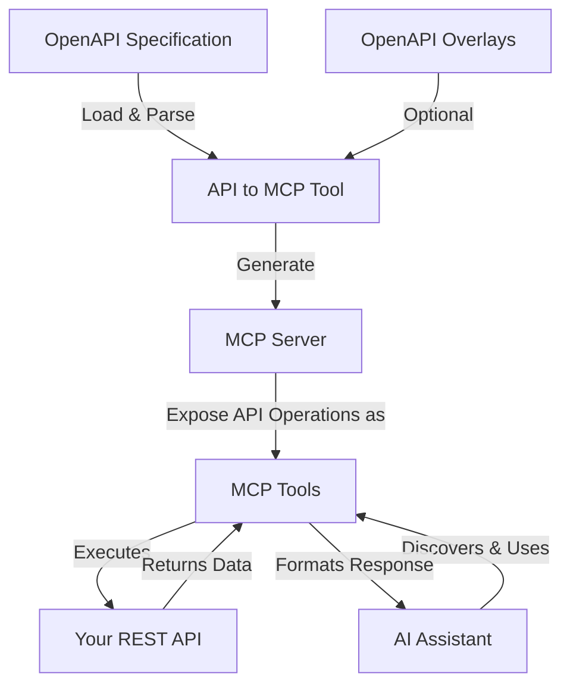

## Overview

**API to MCP** enables the transformation of OpenAPI specifications into MCP-compatible tool definitions. It allows AI assistants to work with your existing APIs without requiring changes to your backend services.

### Key Benefits

- Reuse existing APIs without modification
- Provide standardised access to AI systems
- Apply governance and access controls
- Avoid building custom AI interfaces
- Based on open standards (OpenAPI, MCP)

### Requirements

- Valid OpenAPI (Swagger) specification
- Accessible, live API endpoint

---

## Quick Start

Follow these steps to connect an OpenAPI specification to an AI assistant using API to MCP.

### Prerequisites

- Node.js installed
- A valid OpenAPI/Swagger specification
- Running API service
- AI assistant with MCP support (e.g., [Claude](https://claude.ai/), [VS Code with Cline](https://marketplace.visualstudio.com/items?itemName=anthropic.anthropic-vscode), [Cursor](https://cursor.sh/))

### Step-by-Step Guide

1. Run *API to MCP* tool with your API specification::
   ```bash
   npx -y @tyk-technologies/api-to-mcp --spec=https://petstore3.swagger.io/api/v3/openapi.json
   ```

2. Configure your AI assistant:
   - For Claude Desktop: Add the MCP server to its configuration settings.

3. Ask the AI to perform an operation (e.g., "List all pets").

---

## How It Works

API to MCP serves as a middleware that translates OpenAPI specifications into tools that AI assistants can discover and invoke via MCP.



---

## Use Cases

- **AI-powered API access**: Allow AI to discover and invoke APIs automatically
- **Chatbot integration**: Extend chatbots with backend capabilities
- **Automated documentation**: Use AI to generate contextual docs
- **AI-driven testing**: Let AI validate and explore APIs
- **Workflow automation**: Connect AI with business systems

---

## Jobs-To-Be-Done (JTBD)

### Enable AI Access to Existing APIs

Expose your APIs to AI assistants using OpenAPI specs—no code changes needed.

### Standardise Interactions

Use MCP tool definitions to unify how AI interacts with multiple services.

### Apply Governance

Control which operations are exposed and how they are used.

### Enhance Discovery

Allow AI assistants to auto-discover available operations and metadata.

### Simplify Testing

Leverage natural language to generate test requests and analyse responses.

---

## Best Practices

- **Start small**: Begin with safe, limited API access
- **Whitelist/Blacklist**: Filter API operations carefully
- **Secure headers**: Add auth headers to protect APIs
- **Monitor usage**: Observe AI interaction patterns
- **Version specs**: Use version control for OpenAPI files
- **Use env vars**: Avoid hardcoding secrets
- **Test safely**: Validate before production

---

## FAQs

**Can I use non-REST APIs?**  
Not yet—OpenAPI-based REST APIs are supported. gRPC and GraphQL support is planned.

**Which AI assistants are supported?**  
Any that support MCP: Claude, Cursor, Cline, and others.

**How is authentication handled?**  
Via env vars or config. Use API keys, OAuth, or headers.

**Can I restrict access to specific endpoints?**  
Yes—use whitelists/blacklists in your config or CLI flags.

---

## Troubleshooting

**"Command not found"**  
Try `npx @tyk-technologies/api-to-mcp` to avoid installation issues.

**MCP server doesn't start**  
Check Node.js version and OpenAPI validity.

**AI can't find tools**  
Confirm the MCP server is registered correctly in your assistant.

**Requests fail**  
Check credentials, API URL, and endpoint health.

---

## Installation

### Global

```bash
npm install -g @tyk-technologies/api-to-mcp
```

### Project

```bash
npm install @tyk-technologies/api-to-mcp
```

### Basic Usage

```bash
# No install needed
npx @tyk-technologies/api-to-mcp --spec=https://petstore3.swagger.io/api/v3/openapi.json

# If installed globally
tyk-api-to-mcp --spec=./path/to/openapi.json
```

---

## Configuration

### CLI Options

```bash
tyk-api-to-mcp --spec=./api.json   --overlays=./overlay.json   --whitelist="getPet*,POST:/users/*"   --targetUrl=https://api.example.com
```

### Environment Variables

```bash
export OPENAPI_SPEC_PATH=./api.json
export TARGET_API_BASE_URL=https://api.example.com
export API_KEY=your-api-key
```

### Config File Example

```json
{
  "spec": "./api.json",
  "targetUrl": "https://api.example.com",
  "whitelist": "getPets,createPet,/pets/*",
  "apiKey": "your-api-key",
  "headers": {
    "X-Custom-Header": "value"
  }
}
```

---

## Integration Examples

### Claude Desktop

```json
{
  "mcpServers": {
    "api-tools": {
      "command": "npx",
      "args": [
        "-y",
        "@tyk-technologies/api-to-mcp",
        "--spec",
        "https://petstore3.swagger.io/api/v3/openapi.json"
      ],
      "enabled": true
    }
  }
}
```

### Cursor

```json
{
  "servers": [
    {
      "command": "npx",
      "args": [
        "-y",
        "@tyk-technologies/api-to-mcp",
        "--spec",
        "./api.json"
      ],
      "name": "My API Tools"
    }
  ]
}
```

---

## Development

### Local Setup

```bash
git clone https://github.com/TykTechnologies/api-to-mcp.git
cd api-to-mcp
npm install
npm run build
npm run dev
```

### Fork and Customize

1. Fork the repo
2. Add OpenAPI specs to `specs/`
3. Edit default config
4. Update metadata in `package.json`
5. Publish with:

```bash
npm version 1.0.0
npm publish
```

---

## Summary

API to MCP enables AI assistants to safely and consistently access your APIs by converting OpenAPI specs into MCP tools. This allows teams to leverage existing APIs while adding AI capabilities securely and efficiently.

---

## Resources

- [GitHub Repository](https://github.com/TykTechnologies/api-to-mcp)
- [Tyk AI Management Docs](https://tyk.io/docs/ai-management/)
- [API to MCP Docs](https://tyk.io/docs/ai-management/tyk-mcps/api-to-mcp/)
- [Contact Support](https://tyk.io/contact/)
