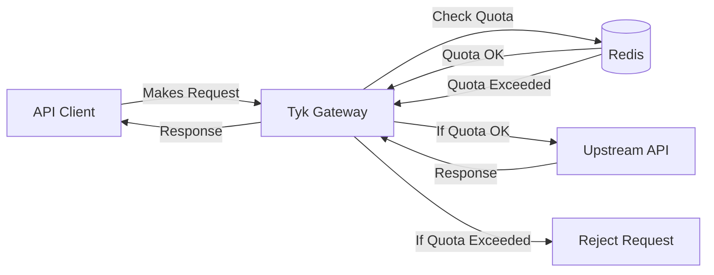

## Introduction

Request Quotas in Tyk Gateway allow you to set a maximum total number of API requests allowed for a specific API key or policy over longer, defined periods (e.g., day, week, month). This feature is distinct from rate limiting (which controls requests per second) and is essential for managing API consumption, enforcing service tiers, and protecting your backend services from sustained overuse over time.



### Key Benefits

*   **Enforce Usage Limits:** Cap the total number of requests allowed over extended periods (days, weeks, months) per consumer.
*   **Implement Tiered Access:** Easily define different usage allowances for various subscription plans (e.g., Free, Basic, Pro).
*   **Protect Backend Services:** Prevent individual consumers from overwhelming upstream services with consistently high volume over long durations.
*   **Enable Usage-Based Monetization:** Provide a clear mechanism for charging based on consumption tiers.

## Quick Start

## Configuration Options

Request Quotas are primarily configured in two places within Tyk:

1.  **Security Policy:** Applying a quota limit to a policy enforces that limit on *all* API keys associated with that policy. This is the recommended approach for managing quotas across groups of users or tiers.
2.  **API Key:** Setting a quota directly on an individual API key overrides any quota set by policies associated with that key. This allows for specific exceptions or custom limits for individual consumers.

Additionally, you can disable quota enforcement entirely for a specific API via its API Definition.

Let's explore the configuration methods:





The Tyk Dashboard provides the most straightforward way to configure quotas, either on a Security Policy or an individual API Key.

**Configuring on a Security Policy:**

1.  Navigate to **System Management > Policies**.
2.  Create a new Policy or **Edit** an existing one.
3.  Locate the **Usage Quotas** section (or similar, depending on UI version - often grouped with Rate Limiting).
4.  Set **Max Requests per period**: Define the maximum number of requests allowed during the reset period (e.g., `10000`). Use `-1` for unlimited.
5.  Set **Quota resets every**: Choose the duration after which the quota allowance replenishes (e.g., `Month`, `Week`, `Day`, or a custom duration in seconds).
6.  Optionally, enable **Set per API Limits and Quota** if you want this policy to define different quotas for specific APIs it grants access to.
7.  **Save** or **Update** the Policy. Keys using this policy will now be subject to this quota.

**Configuring on an API Key:**

1.  Navigate to **System Management > Keys**.
2.  Create a new Key or **Edit** an existing one.
3.  In the **API Access Rights** section, ensure the key has access to the desired API(s).
4.  Enable the **Set per API Limits and Quota** toggle for the specific API you want to apply a key-level quota to.
5.  Configure the **Usage Quotas** for that API within the key's settings:
    *   **Max Requests per period**: Set the limit (e.g., `5000`). Use `-1` for unlimited. This overrides the policy quota for this specific key *for this specific API*.
    *   **Quota resets every**: Select the reset period.
    *   The **Remaining requests for period** field will display the current count (initially equal to Max Requests).
     
    *(Image depicts setting Per API Quotas on a Key)*
6.  **Save** or **Update** the Key.

**Note:** If "Set per API Limits and Quota" is *not* enabled on the key for a specific API, the quota settings from the applied Security Policy (if any) will be used.

Refer to the Dashboard documentation for [Policies]() and [Keys]() for more UI details.





You can configure quotas programmatically by manipulating a key's **Session Object** via the Tyk Gateway API. This is useful for automation or integration with external systems. The session object is a JSON structure associated with each API key.

Key quota parameters within the session object:

*   `quota_max` (Integer): The maximum number of requests allowed in the period. Set to `-1` for unlimited.
*   `quota_remaining` (Integer): The current number of requests left. Typically initialized to the same value as `quota_max`. Tyk decrements this counter.
*   `quota_renewal_rate` (Integer): The duration of the quota period in seconds. The quota will reset *after* this duration has passed, upon the next request using the key.

**Example Session Object Snippet:**

```json
{
  // ... other session object fields like access_rights, org_id etc.
  "quota_max": 10000,
  "quota_remaining": 10000,
  "quota_renewal_rate": 2592000, // 30 days (60*60*24*30)
  "allowance": 1000, // Example rate limit setting (separate from quota)
  "rate": 1000,      // Example rate limit setting
  "per": 60          // Example rate limit setting
  // ...
}
```

**Explanation:**

This snippet configures the key to allow a maximum (`quota_max`) of 10,000 requests. The counter (`quota_remaining`) starts at 10,000. The quota period lasts for 2,592,000 seconds (`quota_renewal_rate`), which is 30 days. After 30 days have elapsed, the *next* request made with this key will trigger a reset of `quota_remaining` back to `quota_max`.

**Note:** Modifying the session object requires using the [Tyk Gateway API endpoint for Keys](). Be careful when updating session objects to preserve other necessary fields.





You cannot *set* quota values within an API Definition, but you can *disable* quota checking entirely for all requests proxied through that specific API, regardless of Key or Policy settings. This is useful if an API should never have quota limits applied.

This is configured within the API Definition file itself.




In a Tyk OAS API Definition (JSON or YAML), set the `disableQuota` field within the `x-tyk-api-gateway` extension object.

```yaml
# Tyk OAS API Definition (YAML Example)
...
x-tyk-api-gateway:
  info:
    name: "My API - No Quotas"
    ...
  middleware:
    disableQuota: true # Set to true to disable quota checks
  ...
upstream:
  url: http://my-backend.com
...

```

Refer to the [Tyk OAS API Definition reference (`disableQuota`)]() for details.




In a Tyk Classic API Definition (JSON), set the `disable_quota` field to `true`.

```json
// Tyk Classic API Definition (JSON Example)
{
  "name": "My API - No Quotas",
  "api_id": "my-api-no-quotas",
  "use_keyless": false,
  "auth": {
    "auth_header_name": "authorization"
  },
  "definition": {
    "location": "header",
    "key": "x-api-version"
  },
  "version_data": {
    "not_versioned": true,
    "versions": {
      "Default": {
        "name": "Default",
        "use_extended_paths": true
      }
    }
  },
  "proxy": {
    "listen_path": "/my-api-no-quotas/",
    "target_url": "http://my-backend.com",
    "strip_listen_path": true
  },
  "disable_quota": true // Set to true to disable quota checks
}

```

Refer to the [Tyk Classic API Definition reference (`disable_quota`)]() for details.








### Important Considerations

*   **Policy Precedence:** Quotas set on a Security Policy apply to all keys using that policy *unless* overridden by a specific quota set directly on the key (using the "Set per API Limits and Quota" option).
*   **Unlimited Quota:** Setting `quota_max` to `-1` grants unlimited requests for the quota period.
*   **Event-Driven Resets:** Quotas reset *after* the `quota_renewal_rate` (in seconds) has passed *and* upon the next request using the key. They do not reset automatically on a fixed schedule (e.g., precisely at midnight or the 1st of the month) unless external automation is used to update the session object.
*   **Response Headers:** When quotas are active, Tyk typically adds `X-RateLimit-Limit`, `X-RateLimit-Remaining`, and `X-RateLimit-Reset` headers to responses, allowing clients to track their usage. (Note: Header names might be configurable).

## How It Works

Request Quotas in Tyk limit the total number of API requests a client can make within a defined time period (hours, days, months). Unlike rate limits that control requests per second, quotas manage the overall consumption volume over longer periods. When a client reaches their quota limit, further requests are rejected until the quota period renews. This feature helps API providers implement usage-based pricing tiers, prevent API abuse, control infrastructure costs, and ensure fair resource distribution among clients. Request Quotas can be applied at individual key, policy, or organization-wide levels, giving you flexible control over how your APIs are consumed.


Think of Request Quotas like a prepaid phone plan with a fixed number of minutes per month. When you sign up, you get allocated a specific number of call minutes (API requests) that you can use over the billing period. You can make calls (API requests) at any pace you want – all at once or spread throughout the month – but once you've used up your allocated minutes, you can't make any more calls until the next billing cycle begins.

In this analogy:
- The phone plan is your API subscription with a specific quota
- The minutes are the number of API requests allowed
- The billing period is the quota renewal period (hour, day, month)
- The usage counter is Tyk tracking how many requests you've made
- The "minutes remaining" display is the quota_remaining value
- The "call blocked" message is the 403 Forbidden response when quota is exceeded
- The new billing cycle is when your quota resets

Just as different phone plans offer different minute allocations, different API keys or policies in Tyk can have different quota limits based on the subscription tier.

## FAQs

<details> <summary><b>What are Request Quotas in Tyk?</b></summary>

Request Quotas in Tyk are limits on the total number of API requests a client can make within a specific time period. Unlike rate limits (which control requests per second), quotas control the total number of requests over longer periods like hours, days, or months. Once a quota is exhausted, further requests are rejected until the quota renews.
</details>

<details> <summary><b>How do Request Quotas differ from Rate Limits?</b></summary>

While both control API usage, they serve different purposes:
- **Rate Limits** control the frequency of requests (e.g., 10 requests per second) to prevent traffic spikes and ensure consistent performance
- **Request Quotas** control the total volume of requests over a longer period (e.g., 10,000 requests per month) to manage overall API consumption and often align with business/pricing models
</details>

<details> <summary><b>How are Request Quotas configured in Tyk?</b></summary>

Request Quotas can be configured at multiple levels:
- **API Level**: Set in the API definition with `disable_quota` flag
- **Key Level**: Set in the session object with parameters like `quota_max`, `quota_renewal_rate`, etc.
- **Policy Level**: Define quotas in policies that can be applied to multiple keys
- **Organization Level**: Set quotas for an entire organization using `enforce_org_quotas`
</details>

<details> <summary><b>What are the key parameters for Request Quotas?</b></summary>

The main parameters for configuring quotas are:
- `quota_max`: Maximum number of requests allowed during the quota period
- `quota_remaining`: Number of requests remaining for the current period
- `quota_renewal_rate`: Time in seconds during which the quota is valid (e.g., 3600 for hourly quotas)
- `quota_renews`: Timestamp indicating when the quota will reset
</details>

<details> <summary><b>Can I disable Request Quotas for specific APIs?</b></summary>

Yes, you can disable quotas for specific APIs by setting the `disable_quota` flag to `true` in the API definition. This will bypass quota checking for all requests to that API, regardless of any quotas set at the key or policy level.
</details>

<details> <summary><b>What happens when a Request Quota is exceeded?</b></summary>

When a quota is exceeded:
1. The request is rejected with a 403 Forbidden status code
2. A "QuotaExceeded" event is triggered (which can be used for notifications or monitoring)
3. The client must wait until the quota renewal period before making additional requests
4. The quota violation is logged and can be monitored in the Tyk Dashboard
</details>

<details> <summary><b>How are Request Quotas tracked and stored?</b></summary>

Tyk stores quota information in Redis:
- Quota keys are prefixed with "quota-" followed by the key identifier
- For each request, Tyk increments a counter in Redis and checks if it exceeds the quota_max
- When a quota period expires, the counter is reset
- For distributed deployments, quota information is synchronized across all Tyk nodes
</details>

<details> <summary><b>Can I set different quotas for different endpoints within the same API?</b></summary>

Yes, you can implement per-endpoint quotas by using policies with the "per_api" partitioning enabled. This allows you to define different quota limits for different API endpoints, giving you fine-grained control over resource usage.
</details>

<details> <summary><b>How do organization-level quotas work?</b></summary>

Organization quotas allow you to limit the total number of requests across all keys belonging to an organization. When enabled (using `enforce_org_quotas`), Tyk tracks the combined usage of all keys in the organization and rejects requests when the organization quota is exceeded, regardless of individual key quotas.
</details>

<details> <summary><b>Can I monitor quota usage and receive notifications before quotas are exceeded?</b></summary>

Yes, Tyk provides quota monitoring capabilities:
- You can set up trigger monitors with percentage thresholds
- When usage reaches a threshold (e.g., 80% of quota), Tyk can trigger notifications
- These notifications can be sent via webhooks to external systems
- The monitoring configuration is set in the `monitor` section of your Tyk configuration
</details>

<details> <summary><b>Why isn't my quota resetting automatically at midnight?</b></summary>

Tyk's quota renewal is event-driven rather than time-driven. Quotas don't automatically reset at specific times (like midnight); instead, they reset when the first request is made after the renewal period has passed. If no requests are made after the renewal time, the quota counter remains unchanged until the next request triggers the check and renewal process.
</details>

<details> <summary><b>How can I manually reset a quota for a specific key?</b></summary>

You can manually reset a quota for a specific key in two ways:

**Via Tyk Dashboard:**
1. Navigate to the "Keys" section
2. Find and select the key you want to reset
3. Click on "Reset Quota" button

**Via Tyk Gateway API:**
```
POST /tyk/keys/reset/{key_id}
Authorization: {your-gateway-secret}
```
This endpoint will reset the quota for the specified key immediately, allowing the key to make requests up to its quota limit again.
</details>

<details> <summary><b>Does Tyk count failed requests against my quota?</b></summary>

Yes, by default Tyk counts all requests against the quota regardless of the response status code (2xx, 4xx, 5xx). This means that even failed requests with error responses will decrement the available quota. This behavior is by design to prevent abuse and ensure consistent quota enforcement regardless of the upstream API's response.
</details>

<details> <summary><b>Why are my quota counts inconsistent in a multi-gateway setup?</b></summary>

In multi-datacenter or multi-region setups, quota inconsistencies can occur due to:

1. **Redis replication lag**: If you're using separate Redis instances with replication, there may be delays in syncing quota information
2. **Network latency**: In geographically distributed setups, network delays can cause temporary inconsistencies
3. **Configuration issues**: Each gateway must be properly configured to use the same Redis database for quota storage

To resolve this, ensure all gateways are configured to use the same Redis database or a properly configured Redis cluster with minimal replication lag. For multi-region deployments, consider using Redis Enterprise or a similar solution with cross-region synchronization capabilities.
</details>

<details> <summary><b>Why do I see "Quota disabled" error logs when I've intentionally disabled quotas?</b></summary>

In some older versions of Tyk, setting `quota_max` to -1 (to disable quotas) would generate an error log message: "Quota disabled: quota max <= 0". This was a known issue that has been fixed in more recent versions.

If you're still seeing these logs, consider:
1. Upgrading to the latest version of Tyk
2. Adjusting your log level to reduce noise
3. Using the API definition's `disable_quota` flag instead of setting `quota_max` to -1

This log message is informational and doesn't indicate a functional problem with your API.
</details>

<details> <summary><b>Can I set quotas to only count successful requests?</b></summary>

By default, Tyk counts all requests against the quota regardless of response code. There is no built-in configuration to count only successful (2xx) responses toward quota limits.

If you need this functionality, you have two options:
1. Implement a custom middleware plugin that conditionally decrements the quota based on response codes
2. Use the Tyk Pump to track successful vs. failed requests separately in your analytics platform, and implement quota management at the application level
</details>

<details> <summary><b>How can I monitor quota usage across my organization?</b></summary>

To monitor quota usage across your organization:

1. **Dashboard Analytics**: Use the Tyk Dashboard to view quota usage for individual keys and APIs
2. **Tyk Pump**: Configure Tyk Pump to send quota usage data to external analytics systems like Elasticsearch, InfluxDB, or Prometheus
3. **Webhooks**: Set up quota threshold webhooks to receive notifications when keys reach certain quota usage percentages
4. **API Endpoints**: Use the Tyk Gateway API to programmatically check quota status for specific keys

For organization-wide visibility, consider implementing a custom dashboard using the analytics data collected via Tyk Pump.
</details>

<details> <summary><b>What happens if I change a quota mid-period?</b></summary>

If you modify a quota configuration mid-period (before the renewal time):

1. For **increasing** the quota: The new maximum will apply, but the current remaining count stays the same
2. For **decreasing** the quota: If the new quota is less than what's already been used, further requests will be rejected
3. For **changing the renewal rate**: The new renewal period will apply from the next renewal

Changes to quota settings take effect immediately but don't reset the current usage counter. If you need to apply new settings and reset the counter immediately, use the "Reset Quota" functionality.
</details>

<details> <summary><b>Can I implement different quota plans for different users?</b></summary>

Yes, Tyk provides several ways to implement different quota plans:

1. **Policies**: Create different policies with varying quota limits and assign them to keys based on subscription level
2. **Key-specific settings**: Override policy quotas for individual keys when necessary
3. **Meta Data**: Use key metadata to dynamically adjust quota behavior through middleware
4. **Multiple APIs**: Create separate API definitions with different quota configurations for different service tiers

This flexibility allows you to implement complex quota schemes that align with your business model and customer tiers.
</details>

<details> <summary><b>How do I troubleshoot quota issues?</b></summary>

When troubleshooting quota issues:

1. **Check Redis**: Ensure Redis is functioning properly and examine the quota keys directly
2. **Review logs**: Look for quota-related messages in the Tyk Gateway logs
3. **Verify configuration**: Confirm that quota settings are correctly configured in policies and API definitions
4. **Test with the API**: Use the Tyk Gateway API to check quota status for specific keys
5. **Monitor request headers**: Examine the `X-Rate-Limit-Remaining` headers in API responses

For multi-gateway setups, also verify that all gateways are using the same Redis instance and that there are no synchronization issues between Redis clusters.
</details>

