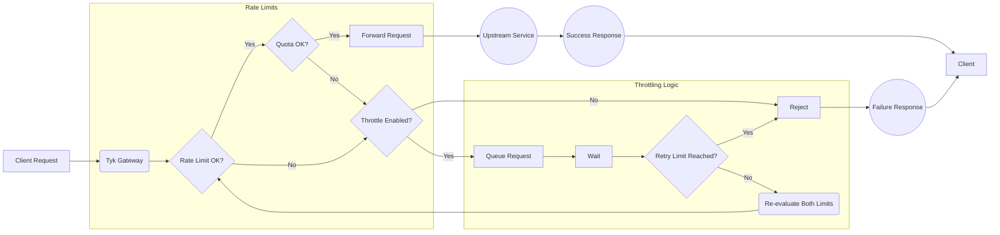

## Introduction

Tyk's Request Throttling feature provides a mechanism to manage traffic spikes by queuing and automatically retrying client requests that exceed [rate limits](), rather than immediately rejecting them. This helps protect upstream services from sudden bursts and improves the resilience of API interactions during temporary congestion.


<!-- TODO: Add an image. -->
---
## Quick Start

### Overview

In this tutorial, we will configure Request Throttling on a Tyk Security Policy to protect a backend service from sudden traffic spikes. We'll start by defining a basic rate limit on a policy, then enable throttling with specific retry settings to handle bursts exceeding that limit, associate a key with the policy, and finally test the behaviour using simulated traffic. This guide primarily uses the Tyk Dashboard for configuration.

### Prerequisites

- **Docker**: We will run the entire Tyk Stack on Docker. For installation, refer to this [guide](https://docs.docker.com/desktop/setup/install/mac-install/)
- **Git**: A CLI tool to work with git repositories. For installation, refer to this [guide](https://git-scm.com/downloads)
- **Dashboard License**: We will configure Request Throttling using Dashboard. [Contact support](https://tyk.io/contact/) to obtain a license
- **Curl, seq and xargs**: These tools will be used for testing

### Instructions



#### Create an API

5.  **Create an API:**
    1. Log in to your Tyk Dashboard.
    2. Navigate to **API Management > APIs**
    3. Click **Add New API**
    4. Click **Import**
    5. Select **Import Type** as **Tyk API**
    6. Copy the below Tyk OAS definition in the text box and click **Import API** to create an API

        <details>
        <summary><b>Click to expand API Definition</b></summary>

        ```json
        {
            "components": {
                "securitySchemes": {
                    "authToken": {
                        "in": "header",
                        "name": "Authorization",
                        "type": "apiKey"
                    }
                }
            },
            "info": {
                "title": "Request Throttling Test",
                "version": "1.0.0"
            },
            "openapi": "3.0.3",
            "paths": {},
            "security": [
                {
                    "authToken": []
                }
            ],
            "servers": [
                {
                    "url": "http://tyk-gateway.localhost:8080/request-throttling-test/"
                }
            ],
            "x-tyk-api-gateway": {
                "info": {
                    "name": "Request Throttling Test",
                    "state": {
                        "active": true
                    }
                },
                "middleware": {
                    "global": {
                        "contextVariables": {
                            "enabled": true
                        },
                        "trafficLogs": {
                            "enabled": true
                        }
                    }
                },
                "server": {
                    "authentication": {
                        "enabled": true,
                        "securitySchemes": {
                            "authToken": {
                                "enabled": true
                            }
                        }
                    },
                    "listenPath": {
                        "strip": true,
                        "value": "/request-throttling-test/"
                    }
                },
                "upstream": {
                    "rateLimit": {
                        "enabled": false,
                        "per": "10s",
                        "rate": 5
                    },
                    "url": "http://httpbin.org/"
                }
            }
        }
        ```

        </details>

#### Configure Policy and Rate Limit {#policy-setup}
6.  **Create and Configure an Security Policy with Rate Limiting:**

    <details>
    <summary><b>Click to expand to see a detailed steps to configure rate limit in the Tyk Dashboard UI</b></summary>

    1.  Navigate to **API Security > Policies** in the Tyk Dashboard sidebar
    2.  Click the **Add Policy** button
    3.  Under the **1. Access Rights** tab, in the **Add API Access Rule** section, select the `Request Throttling Test` API
    4.  Scroll down to the **Global Limits and Quota** section (still under the **1. Access Rights** tab):
        *   Set the following values for `Rate Limiting`
        *   Enter `5` into the **Requests (or connection attempts)** field
        *   Enter `10` into the **Per (seconds):** field
    5.  Select the **2. Configuration** tab
    6.  In the **Policy Name** field, enter `Request Throttling Policy`
    7.  From the **Key expire after** dropdown, select `1 hour`
    8.  Click the **Create Policy** button
        
    </details>

    

7.  **Associate an Access Key with the Policy:**

    <details>
    <summary><b>Click to expand to see a detailed steps to Associate an Access Key with the Policy in the Tyk Dashboard UI</b></summary>

    1.  Navigate to **API Security > Keys** in the Tyk Dashboard sidebar
    2.  Click the **Add Key** button
    3.  Under the **1. Access Rights** tab:
        *   In the **Apply Policy** section, select the `Request Throttling Policy` API
    5.  Select the **2. Configuration** tab
    6.  In the **Alias** field, enter `Request Throttling Key`
    7.  From the **Expires** dropdown, select `Do not expire key`
    8.  Click the **Create Key** button
    9.  A pop-up window **"Key created successfully"** will appear displaying the key details. **Copy the Key ID (hash)** value shown and save it securely. You will need this key to make API requests in the following steps
    10. Click **OK** to close the pop-up

    </details>

8. **Test Rate Limit**

    So far, we've created a policy for an API definition and created a key that complies with that policy. Before enabling throttling, let's observe the standard rate limiting behaviour. We'll send 10 requests in quick succession using `xargs` to simulate a burst that exceeds our configured limit (5 requests per 10 seconds).

    1.  Open your terminal.
    2.  Execute the following command, replacing `<replace-with-key-id>` with the API Key ID you saved earlier:

        ```bash
        seq 10 | xargs -n1 -P10 -I {} bash -c 'curl -s -I -H "Authorization: <replace-with-key-id>" http://tyk-gateway.localhost:8080/request-throttling-test/ | head -n 1'
        ```

    3.  **Expected Observation:** You should see some requests succeed with `HTTP/1.1 200 OK`, followed quickly by several requests failing with `HTTP/1.1 429 Too Many Requests` as the rate limit is immediately enforced. The order of `200s` vs `429s` might vary depending upon the processing time, but you will see immediate rejections once the limit is hit.

    **Sample Output (Illustrative):**

    ```bash
    HTTP/1.1 429 Too Many Requests
    HTTP/1.1 429 Too Many Requests
    HTTP/1.1 429 Too Many Requests
    HTTP/1.1 429 Too Many Requests
    HTTP/1.1 429 Too Many Requests
    HTTP/1.1 200 OK
    HTTP/1.1 200 OK
    HTTP/1.1 200 OK
    HTTP/1.1 200 OK
    HTTP/1.1 200 OK
    ```

#### Configure Throttling
9.  **Configure Request Throttling by Updating the Security Policy**

    1.  Navigate to **API Security > Policies** in the Tyk Dashboard sidebar
    2.  Click on the `Request Throttling Policy`
    3.  Under the **1. Access Rights** tab:
        *   In the **Global Limits and Quota** section
        *   Set the following values for `Throttling`
        *   Uncheck the `Disable Throttling` checkbox
        *   Enter `3` into the **Throttle retries (or connection attempts)** field
        *   Enter `2` into the **Per (seconds):** field
    4.  Click the **Update** button
    5.  A pop-up window will appear to confirm the changes. Click **Update** to close the pop-up

#### Testing
10. **Test Request Throttling**

    1.  **Repeat the Test:** Open your terminal and execute the *exact same command* as in step 4:

        ```bash
        seq 10 | xargs -n1 -P10 -I {} bash -c 'curl -s -I -H "Authorization: <replace-with-key-id>" http://tyk-gateway.localhost:8080/request-throttling-test/ | head -n 1'
        ```

    2.  **Expected Observation:**
        *   You will still see the first ~5 requests return `HTTP/1.1 200 OK` quickly
        *   Critically, the subsequent requests (6 through 10) will **not** immediately return `429`. Instead, you should observe a **delay** before their status lines appear
        *   After the delay (`throttle_interval`), Tyk will retry the queued requests. Some might now succeed (return `200 OK`) if the rate limit window allows
        *   If a request is retried `throttle_retry_limit` (3) times and still encounters the rate limit, *then* it will finally return `HTTP/1.1 429 Too Many Requests`
        *   Overall, you might see more `200 OK` responses compared to the previous test, and any `429` responses will appear significantly later

    **Sample Output (Illustrative - timing is key):**

    ```bash
    HTTP/1.1 200 OK  # Appears quickly
    HTTP/1.1 200 OK  # Appears quickly
    HTTP/1.1 200 OK  # Appears quickly
    HTTP/1.1 200 OK  # Appears quickly
    HTTP/1.1 200 OK  # Appears quickly
    # --- Noticeable pause here ---
    HTTP/1.1 200 OK
    # --- Noticeable pause here ---
    HTTP/1.1 200 OK
    # --- Noticeable pause here ---
    HTTP/1.1 200 OK
    HTTP/1.1 200 OK
    HTTP/1.1 200 OK
    ```
    *(The exact mix of 200s and 429s on the delayed requests depends heavily on timing relative to the 10-second rate limit window reset and the retry attempts).*

This comparison clearly shows how Request Throttling changes the behaviour from immediate rejection to queued retries, smoothing the traffic flow and potentially allowing more requests to succeed during bursts.

---
## Configuration Options

Request Throttling is configured within Tyk [Security Policies]() or directly on individual [Access Keys]().

The configuration involves setting two specific fields:

- `throttle_interval`: Defines the wait time (in seconds) between retry attempts for a queued request. (*Note*: Do not set it to `0`. If you do, no delay is applied, and the request is immediately retried. This will creates a “busy waiting” scenario that consumes more resources than a positive interval value)
- `throttle_retry_limit`: Sets the maximum number of retry attempts before the request is rejected. (*Note*: Do not set it to `0`. Setting it to `0` means that there will be no throttling on the request)

To enable throttling, both fields must be set to a value greater than `0`. 

### Disable throttling

The default value is `-1` and means it is disabled by default.
Setting `throttle_interval` and `throttle_retry_limit` values to any number smaller than `0`, to ensure the feature is diabled.

You can configure these settings using either the Tyk Dashboard UI or the Tyk Dashboard API.

### Configure via UI

The Tyk Dashboard provides a straightforward interface to set throttling parameters on both Security Policies and Access Keys.





The image below shows a policy with throttling. Any key using this policy will inherit the throttling settings and behaves as follows: wait 2 seconds between retries for queued requests, attempting up to 3 times before failing (so overall 6 seconds before getting another 429 error response).



<br>
<details>
<summary><b>Click to expand to see a detailed steps to configure Request Throttling in the Tyk Dashboard UI</b></summary>

1.  Navigate to **API Security > Policies** in the Tyk Dashboard sidebar
2.  Click the **Add Policy** button
3.  Under the **1. Access Rights** tab and in the **Add API Access Rule** section, select the required API
4.  Scroll down to the **Global Limits and Quota** section (still under the **1. Access Rights** tab):
    *   To enable `Throttling`, `Rate Limiting` should be configured
    *   Enter some value into the **Requests (or connection attempts)** field
    *   Enter some value into the **Per (seconds):** field
    *   Now enable `Throttling` by setting the following values in the `Throttling` section:
    *   Uncheck the `Disable Throttling` checkbox
    *   Enter some value into the **Throttle retries (or connection attempts)** field
    *   Enter some value into the **Per (seconds):** field
5.  Select the **2. Configuration** tab
6.  In the **Policy Name** field, enter a name
7.  From the **Key expire after** dropdown, select an option
8.  Click the **Create Policy** button
</details>





Note: Direct key configuration overrides policy settings only for that specific key.

1.  Navigate to **API Security > Keys** in the Tyk Dashboard sidebar
2.  Click the **Create Key** button
3.  Under the **1. Access Rights** tab:
    *   Select **Choose API**
    *   In the **Add API Access Rule** section, select the required API
4.  Scroll down to the **Global Limits and Quota** section (still under the **1. Access Rights** tab):
    *   To enable `Throttling`, `Rate Limiting` should be configured
    *   Enter some value into the **Requests (or connection attempts)** field
    *   Enter some value into the **Per (seconds):** field
    *   Now enable `Throttling` by setting the following values in the `Throttling` section:
    *   Uncheck the `Disable Throttling` checkbox
    *   Enter some value into the **Throttle retries (or connection attempts)** field
    *   Enter some value into the **Per (seconds):** field
5.  Select the **2. Configuration** tab
6.  In the **Alias** field, enter a name
7.  From the **Expires** dropdown, select an option
8.  Click the **Create Key** button





### Configure via API

These are the fields that you can set directly in the Policy object or the Access Key:

```json
{
  // ... other policy/session object fields ...
  "throttle_interval": 2,       // Wait 1 second between retries
  "throttle_retry_limit": 3,    // Attempt a maximum of 5 retries
  // ... other policy/session fields ...
}
```





To update the policy, do the following:
1. Retrieve the policy object using `GET /api/portal/policies/{POLICY_ID}`
2. Add or modify the `throttle_interval` and `throttle_retry_limit` fields within the policy JSON object
3. Update the policy using `PUT /api/portal/policies/{POLICY_ID}` with the modified object, or create a new one using `POST /api/portal/policies/`

**Explanation:**
The above adds throttling to a policy. Any key using this policy will inherit the throttling settings and behaves as follows: wait 1 second between retries for queued requests, attempting up to 5 times before failing (so overall 5 seconds before getting another 429 error response).





Note: Direct key configuration overrides policy settings only for that specific key.

To update the access key do the following:
1. Retrieve the key's session object using `GET /api/keys/{KEY_ID}`
2. Add or modify the `throttle_interval` and `throttle_retry_limit` fields within the session object JSON
3. Update the key using `PUT /api/keys/{KEY_ID}` with the modified session object


**Explanation:**
The above adds throttling to a key. Any request made by the key will behave as follows: wait 1 second between retries for queued requests, attempting up to 5 times before failing (so overall 5 seconds before getting another 429 error response).





---
## How It Works

TODO: This will work after the changes in Tyk streams is merged. For review you can copy the code and it into a mermaid editor.



Tyk's Request Throttling intercepts API requests *after* they have exceeded a configured [Rate Limit](). 

Instead of immediately rejecting these requests with a `429 Too Many Requests` error (which is the default rate-limiting behaviour), the Gateway temporarily holds them in a queue. After waiting for a specified duration (`throttle_interval`), Tyk attempts to process the request again, re-checking the rate limit status. 

This retry cycle repeats until either the request can be successfully processed (if capacity becomes available) or a configured maximum number of retries (`throttle_retry_limit`) is reached. Only after exhausting all retries does Tyk return the `429` error to the client.

Think of it like trying to access a service with a restriction on how many people can enter per minute (Rate Limit). If you arrive when the per-minute limit is full, standard behaviour is to turn you awa
y immediately. With Throttling enabled, the service instead asks you to wait briefly (the interval) and tries your entry again shortly, checking if the rate limit has freed up capacity, repeating this a f
ew times (the retry limit) before finally turning you away if access is still restricted.

---
## FAQ

<details> <summary><b>What is the difference between rate limiting and request throttling in Tyk?</b></summary>

Rate limiting and request throttling serve different purposes in Tyk:

-   Rate Limiting: Sets a maximum number of requests allowed within a specific time window (e.g., 100 requests per minute). When the limit is reached, additional requests receive an HTTP 429 error response.

-   Request Throttling: A mechanism that queues and auto-retries client requests when they hit quota or rate limits. Instead of immediately rejecting excess requests, Tyk will queue them and retry automatically based on configured parameters.

Rate limiting is about rejecting excess traffic, while throttling is about managing and smoothing traffic spikes by queuing and retrying requests.

</details> 

<details> <summary><b>How do I configure request throttling in Tyk?</b></summary>

Refer to this [documentation]().

</details> 

<details> <summary><b>Is request throttling enabled by default in Tyk?</b></summary>

No, request throttling is disabled by default in Tyk. The default values for both `throttle_interval` and `throttle_retry_limit` are set to `-1` , which means the feature is inactive. To enable throttling, you need to explicitly set positive values for both parameters.

</details> 