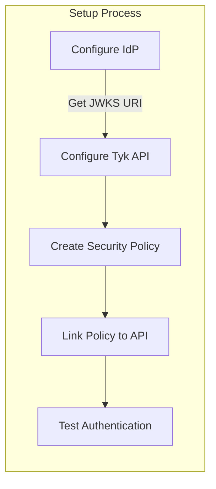

## Introduction

JSON Web Token (JWT) is an open standard ([RFC 7519](https://datatracker.ietf.org/doc/html/rfc7519)) that defines a compact and self-contained way for securely transmitting claims between parties as a JSON object. The information in the JSON object is digitally signed using either a secret (with the HMAC algorithm) or a public/private key pair (using RSA or ECDSA encryption) allowing the JWT to be used for client authentication.

The claims within the JWT can be used by Tyk Gateway's authorization process to configure rate and quota limits via Tyk's [Security Policy]() system. Within the API definition, JWT claims can be "mapped" onto security policies which will then be applied to the request.

JWTs are issued by third party Identity Providers (IdP), with the appropriate claims being set by the IdP according to the client's permissions. The client presents the JWT as the access token in the API request to Tyk Gateway. Tyk validates the JWT signature against a JSON Web Key (JWK) retrieved from the IdP and, assuming the JWT is valid, then applies access policies according to the scope-to-policy mapping declared in the API definition.

A key advantage of JWT authentication is that Tyk does not store any user credentials or session data.

### Key Benefits

- **Stateless Authentication**: Eliminates the need for server-side session storage, improving scalability.
- **Flexible Integration**: Works with multiple identity providers including Auth0, Okta, and custom JWT issuers.
- **Enhanced Security**: Supports multiple signature validation methods (RSA, ECDSA, HMAC) and claim verification.
- **Granular Access Control**: Leverage JWT claims for policy enforcement and scope-based permissions.
- **Performance Optimized**: Efficient token validation with minimal overhead and support for JWKS caching.

## Quick Start: Securing APIs with Auth0 or Keycloak

In this tutorial, we'll secure a Tyk OAS API using JWT authentication with either Auth0 or Keycloak as the identity provider. We'll start by configuring the identity provider, then set up JWT validation in Tyk, create a security policy, configure the API to use the policy, and finally test the secured API with a valid token.



### Prerequisites

- A Tyk installation (Cloud or Self-Managed) with Tyk Dashboard license
- An Auth0 account or Keycloak installation
- An existing Tyk OAS API (see [this tutorial]())
- Postman, cURL, or another API testing tool

### Step-by-Step Guide

#### 1. Configure Your Identity Provider to obtain your JWKS URI

##### Option A: Auth0 Setup

1. Log in to your Auth0 dashboard
2. Navigate to Applications > APIs and click Create API
3. Enter a name and identifier (audience) for your API
4. Note your Auth0 domain (e.g. `your-tenant.auth0.com`)
5. Your JWKS URI will be: `https://your-tenant.auth0.com/.well-known/jwks.json`

##### Option B: Keycloak Setup

1. Log in to your Keycloak admin console
2. Create or select a realm (e.g. `tyk-demo`)
3. Navigate to Clients and create a new client with:
    Client ID: `tyk-api-client`
    Client Protocol: `openid-connect`
    Access Type: `confidential`
4. After saving, go to the Installation tab and select "OIDC JSON" format
5. Your JWKS URI will be: `http://your-keycloak-host/realms/tyk-demo/protocol/openid-connect/certs`

#### 2. Create a Security Policy

1. In the Tyk Dashboard, navigate to **Policies**
2. Click **Add Policy**
3. Configure the policy:
    Name: `JWT Auth Policy`
    APIs: Select your Tyk OAS API
    Access Rights: Configure appropriate paths and methods
    Authentication: Select JWT
    JWT Scope Claim Name: Enter the JWT claim that contains scopes (e.g. `scope` or `permissions`)
    Required Scopes: Add any required scopes for access (optional)
4. Click Create to save your policy

#### 3. Configure JWT Authentication in Tyk OAS API

1. Navigate to APIs and select your API
2. Click **Edit**
3. Enable **Authentication** in the **Server** section, select **JSON Web Token (JWT)** as the authentication method
4. Configure the JWT settings:
    Token Signing Method: Select `RSA Public Key`
    Subject identity claim: Set to `sub`
    JWKS Endpoint: Enter [your JWKS URI for your IdP]())
    Policy claim: Set to `pol`
    Default policy: Select `JWT Auth Policy` (the policy you created previously)
    Clock Skew (optional): Set to accommodate time differences (e.g. `10`)
    Authentication Token Location: `header`
    Header Name: `Authorization`
    Strip Authorization Data: `Enabled`
5. Click **Save API**

#### 4. Test your API

1. Obtain a JWT from your IdP
2. Make a request to your API providing the JWT as a Bearer token in the `Authorization` header; Tyk will validate the JWT using the JWKS that it retrieves from your JWKS URI
3. Observe that the request is successful

```bash
    curl -X GET {API URL}  -H "Accept: application/json" -H "Authorization: Bearer {token}"
```


## How JWT Authentication works with Tyk

This diagram outlines the flow when using JWT Auth to secure access to your API.



Once Alice has obtained a JWT (steps 1, 2, 3) they will present that with their request to Tyk Gateway (step 4).

In step 5, Tyk will first authenticate Alice by validating the JWT using the following steps:

- locate the JWT in the request (header, cookie or query parameter)
- decode the JWT
- extract the `kid` (Key ID) from the token header
- fetch the public keys from all configured JWKS URIs (or use locally declared static public key)
- merge all the retrieved public keys into a single list
- search this list for a public key matching the extracted `kid`
    - if no match is found, the validation fails, and the request is rejected
- if a matching key is found, the JWT signature is validated using the parameters in the JWK
    - if signature validation fails, the request is rejected
- if signature validation is successful then the client is authenticated, and the request is accepted
- use the value in the subject identity claim within the JWT (identified by the value stored in `identityBaseField`) to create an internal session for Alice's request

In step 6, now that Authentication is complete and an internal session has been created for the request, Tyk will proceed to Authorization by checking other claims to determine which Security Policies should be applied to the session:

- check for the value in the policy claim within the JWT (identified by the value stored in `policyFieldName`)
- use this to identify the Tyk Security Policy (or policies) to be applied to the request
    - if there is no policy mapped, then the `defaultPolicy` will be used
- apply the identified policies to the session, configuring access rights, rate limits and usage quota 


## Configuring your API to use JWT authentication

The OpenAPI Specification treats JWT authentication as a variant of [bearer authentication](https://swagger.io/docs/specification/v3_0/authentication/bearer-authentication/) in the `components.securitySchemes` object using the `type: http`, `scheme: bearer` and `bearerFormat: jwt`:

```yaml
components:
  securitySchemes:
    myAuthScheme:
      type: http
      scheme: bearer
      bearerFormat: jwt

security:
  - myAuthScheme: []
```

With this configuration provided by the OpenAPI description, in the Tyk Vendor Extension we need to enable authentication, to select this security scheme and to indicate where Tyk should look for the credentials. Usually the credentials will be provided in the `Authorization` header, but Tyk is configurable, via the Tyk Vendor Extension, to support custom header keys and credential passing via query parameter or cooke.

```yaml
x-tyk-api-gateway:
  server:
    authentication:
      enabled: true
      securitySchemes:
        myAuthScheme:
          enabled: true
          header:
            enabled: true
            name: Authorization
```

Note that URL query parameter keys and cookie names are case sensitive, whereas header names are case insensitive.

You can optionally [strip the user credentials]() from the request prior to proxying to the upstream using the `authentication.stripAuthorizationData` field (Tyk Classic: `strip_auth_data`).

With the JWT method selected, you'll need to configure Tyk to handle the specific configuration of JSON Web Tokens that clients will be providing. All of the JWT specific configuration is performed within the [authentication.jwt]() object in the Tyk Vendor Extension.

### Locating the JWT in the Request

The OpenAPI Specification's `securitySchemes` mechanism allows you to specify the location of the JWT, but only one (for example, in the request header). In some scenarios an API might need to support multiple potential locations to support different clients.

The Tyk Vendor Extension supports this by allowing configuration of alternative locations in the JWT entry in `server.authentication.securitySchemes`. Building on the previous example, we can add optional query and cookie locations as follows:

```yaml
x-tyk-api-gateway:
  server:
    authentication:
      enabled: true
      securitySchemes:
        myAuthScheme:
          enabled: true
          header:
            enabled: true
            name: Authorization
          query:
            enabled: true
            name: query-auth
          cookie:
            enabled: true
            name: cookie-auth
```

### JWT Signatures

Tyk can validate JSON Web Tokens signed using the following methods:

| Method | Cryptographic style | Secret type    | Suppported locations for secret  |
|--------|---------------------|----------------|----------------------------------|
| HMAC   | symmetric           | Shared secret  | API definition                   |
| RSA    | asymmetric          | Public key     | API definition, JWKS endpoint    |
| ECDSA  | asymmetric          | Public key     | API definition, JWKS endpoint    |

#### RSA Supported Algorithms

Both RSA & PSA classes of RSA algorithms are supported by Tyk, including:
- RS256
- RS384
- RS512 
- PS256
- PS384
- PS512

Read more about the differences between RSA & PSA classes of RSA algorithms [here](https://www.encryptionconsulting.com/overview-of-rsassa-pss/).

To use either - simply select the "RSA" signing method in your API definition, and Tyk will use the appropriate algorithm based on the key you provide.

#### Secret Management

You must provide Tyk with the secret or key to be used to validate the incoming JWTs.

- for the asymmetric methods (RSA and ECDSA) the public key can be stored in the API definition or Tyk can retrieve from a public JSON Web Key Sets (JWKS) endpoint (supporting dynamic rotation of keys in the JWKS)
- for symmetric encryption (HMAC), the secret is shared between the client and Tyk and so is stored within the API definition not on the public JWKS server

##### Locally stored keys and secrets

When storing the key or secret in the API definition, it is first base64 encoded and then configured in `server.authentication.securitySchemes.<jwtAuthScheme>.source`. For improved separation of concerns and flexibility, the key/secret can be placed in an [external key value store](), with the appropriate reference configured in the API definition.

For example, this fragment will configure the JWT authentication middleware to use the secret located at `consul://secrets/jwt-secret` to validate the signature of incoming JWTs. Note that the external KV store reference has been base64 encoded and then stored in `source`:

```yaml
x-tyk-api-gateway:
  server:
    authentication:
      securitySchemes:
        jwtAuth:
          source: Y29uc3VsOi8vc2VjcmV0cy9qd3Qtc2VjcmV0
```

##### Remotely stored keys (JWKS endpoint)

Prior to Tyk 5.9.0, the middleware can only validate the incoming JWT against a single JWKS endpoint. The full URI (including protocol) must be base64 encoded and configured in `<jwtAuthScheme>.source`.

For example, the following fragment will configure the JWT authentication middleware to retrieve the JWKS from `https://your-tenant.auth0.com/.well-known/jwks.json` when validating the signature of incoming JWTs. Note that the JWKS endpoint has been base64 encoded and then stored in `source`:

```yaml
x-tyk-api-gateway:
  server:
    authentication:
      securitySchemes:
        jwtAuth:
          source: aHR0cHM6Ly95b3VyLXRlbmFudC5hdXRoMC5jb20vLndlbGwta25vd24vandrcy5qc29u
```

From **Tyk 5.9.0** onwards, Tyk can validate against multiple JWKS endpoints, allowing you to use different IdPs to issue JWTs for the same API. Multiple JWKS endpoints can be configured in the `<jwtAuthScheme>.jwksURIs` array. Note that these URIs are not base64 encoded in the API definition and so are human-readable. Tyk will retrieve the JSON Web Key Sets from each of these endpoints and these will be used to attempt validation of the received JWT.

For example, the following fragment will configure the JWT authentication middleware to retrieve the JWKS from both Auth0 and Keycloak when validating the signature of incoming JWTs:

```yaml
x-tyk-api-gateway:
  server:
    authentication:
      securitySchemes:
        jwtAuth:
          jwksURIs:
            - url: https://your-tenant.auth0.com/.well-known/jwks.json
            - url: http://your-keycloak-host/realms/tyk-demo/protocol/openid-connect/certs
```

*Multiple JWKS endpoints and the `jwksURIs` array are not supported by Tyk Classic APIs.*<br><br>


**Note**  

If both `<jwtAuthScheme>.source` and `<jwtAuthScheme>.jwksURIs` are configured, the latter will take precedence.


### JWT Validity and Clock Skew

JSON Web Tokens have a validity period described using three [Registered Claims](https://datatracker.ietf.org/doc/html/rfc7519#section-4.1): `IssueAt`, `ExpireAt` and `NotBefore`.

If, on receipt of the JWT, Tyk determines that the token is not valid then it will reject the request with the "Token is not valid yet" error.

Due to the nature of distributed systems it is expected that, despite best efforts, you can end up in a situation with clock skew between the party issuing the JWT (your IdP) and the validating party (Tyk). This might occur due to the clock on the Tyk server being behind or ahead of the clock on the Identity Provider server even with all servers synchronised from the same NTP server.

You can optionally configure a maximum permissable difference between the timestamp in the token's validity claims and Tyk's clock, to allow for these scenarios. Each can be independently configured or omitted from the API configuration as required. The permissable skews are configured in seconds.

```yaml
x-tyk-api-gateway:
  server:
    authentication:
      securitySchemes:
        jwtAuth:
          issuedAtValidationSkew: 5
          notBeforeValidationSkew: 2
          expiresAtValidationSkew: 2
```

### Managing Authorization with JWT

The claims within the JSON Web Token are used to configure the Authorization for the request - i.e. which resources it can access and what limits should be applied to that access.

#### Identifying the originator

Tyk creates an internal [session object]() for the request, which is linked to the originator via the **Subject claim** in the JWT. Typically the [Registered claim](https://datatracker.ietf.org/doc/html/rfc7519#section-4.1.2") `sub` (subject) is used for this purpose, but Tyk allows you to use any claim in the token payload. You must configure the `identityBaseField` to state which JWT claim to use.

```yaml
x-tyk-api-gateway:
  server:
    authentication:
      securitySchemes:
        jwtAuth:
          identityBaseField: sub
```

#### Identifying the Tyk policies to be applied

Security Policies are applied to the session object to configure authorization for the request.

You **must** configure one or more *default policies* that will be applied if no specific policies are identified in the JWT claims. These are configured using the `defaultPolicies` field in the API definition, which accepts a list of policy Ids. Note that you must [create the policies]() (to obtain their policy Id) before you can add them to the API definition.

```yaml
x-tyk-api-gateway:
  server:
    authentication:
      securitySchemes:
        jwtAuth:
          defaultPolicies:
            - 685a8af28c24bdac0dc21c28
            - 685bd90b8c24bd4b6d79443d
```

You can optionally specify the policies to be applied to the session via the *policy claim* in the JWT. This is a [Private Claim](https://datatracker.ietf.org/doc/html/rfc7519#section-4.3) and can be anything you want, but typically we recommend the use of `pol`. If you do not want to use the *default policies* then you must instruct Tyk where to look for the policy claim by configuring the `policyFieldName` field in the API definition.

```yaml
x-tyk-api-gateway:
  server:
    authentication:
      securitySchemes:
        jwtAuth:
          policyFieldName: pol
```

In the JWT, you should then provide the list of policy Ids as an array of values in that claim, for example you might declare:

```
  "pol": ["685a8af28c24bdac0dc21c28", "685bd90b8c24bd4b6d79443d"]
```

##### Advanced policy mapping

Registering the policy Ids in the IdP that issues JWTs may not provide the flexibility required, so Tyk supports a more advanced approach where policies are applied based upon *scopes* declared in the JWT. This keeps separation between the IdP and Tyk-specific concepts.

Within the JWT, you identify a Private Claim that will hold the authorization (or access) scopes for the API. You then provide, within that claim, a list of *scopes*. In your API definition, you configure the `scopes.claimName` to instruct Tyk where to look for the scopes and then you declare a mapping of scopes to policies within the `scopes.scopeToPolicyMapping` object.

```yaml
x-tyk-api-gateway:
  server:
    authentication:
      securitySchemes:
        jwtAuth:
          scopes:
            scopeToPolicyMapping:
              - scope: read-only
                policyId: 685bd90b8c24bd4b6d79443d
              - scope: read-write
                policyId: 685a8af28c24bdac0dc21c28
            claimName: accessScopes
```

In this example, Tyk will check the `accessScopes` claim within the incoming JWT and apply the appropriate policy if that claim contains the value `read-only` or `read-write`. If neither scope is declared in the claim, or the claim is missing, then the default policy will be applied.

The claim value within the JWT could be any of the following:

- a string with space delimited list of values (by standard)
- a slice of strings
- a string with space delimited list of values inside a nested key
- a slice of strings inside a nested key
  
If there is a nested key, then you must use dot notation in the value configured for `claimName`. For example, if `scope2` is a slice of strings or list of values nested within `scope2`, then you would set `claimName: scope1.scope2`.

##### Combining policies

Where multiple policies will be applied to a key (for example, if several scopes are declared in the JWT claim, or if you set multiple *default policies*) it's important when creating those policies to ensure that they do not conflict with each other. Tyk will apply OR logic when combining policies.

We recommend the use of [partitioned policies]() for selective control of access rights and usage limits to an API. All policies should have `per_api` set to `true` to ensure that their configuration is not applied universally and shouldn't have the same `API ID` in access rights.

### Using Tyk Classic APIs

As noted in the Tyk Classic API [documentation](), you can select JSON Web Token authentication using the `use_jwt` option. Tyk Classic APIs do not natively support multiple JWKS endpoints, though a [custom authentication plugin]() could be used to implement this functionality.


## Split Token Flow

OAuth2, OIDC, and their foundation, JWT, have been industry standards for many years and continue to evolve, particularly with the iterative improvements in the OAuth RFC, aligning with FHIR and Open Banking principles. The OAuth flow remains a dominant approach for secure API access.

In the OAuth flow, two types of access tokens are commonly used: opaque and JWT (more precisely, JWS). However, the use of JWTs has sparked debates regarding security, as JWTs can leak information when base64 decoded. While some argue that JWTs should not contain sensitive information, others consider JWTs inherently insecure for authorization.

The Split Token Flow offers a solution by storing only the JWT signature on the client side while keeping the header and payload on the server side. This approach combines the flexibility of JWTs with the security of opaque tokens, ensuring that sensitive data is not exposed.

### How Tyk Implements Split Token Flow

Tyk API Gateway is well-positioned to broker the communication between the client and the authorization server. It can handle requests for new access tokens, split the JWT, and return only the signature to the client, storing the rest of the token internally.

Here’s how you can implement the Split Token Flow using the OAuth 2.0 client credentials flow:

#### Request a JWT Access Token

```bash
$ curl -X POST -H "Content-Type: application/x-www-form-urlencoded" \
https://keycloak-host/auth/realms/tyk/protocol/openid-connect/token \
-d "grant_type=client_credentials" \
-d "client_id=efd952c8-df3a-4cf5-98e6-868133839433" \
-d "client_secret=0ede3532-f042-4120-bece-225e55a4a2d6" -s | jq
```

This request returns a JWT access token.

#### Split the JWT

The JWT consists of three parts:

* Header: `eyJhbGciOiJIUzI1NiIsInR5cCI6IkpXVCJ9`
* Payload: `eyJzdWIiOiIxMjM0NTY3ODkwIiwibmFtZSI6IkpvaG4gRG9lIiwiaWF0IjoxNTE2MjM5MDIyLCJlbWFpbCI6ImhlbGxvQHdvcmxkLmNvbSJ9`
* Signature: `EwIaRgq4go4R2M2z7AADywZ2ToxG4gDMoG4SQ1X3GJ0`

Using the Split Token Flow, only the signature is returned to the client, while the header and payload are stored server-side by Tyk.



#### Create a Virtual Endpoint in Tyk

Create a virtual endpoint or API in Tyk to handle the token request. This endpoint receives the auth request, exchanges credentials with the authorization server, and returns the split token.

**Example script for the Virtual Endpoint:**

```javascript
function login(request, session, config) {
    var credentials = request.Body.split("&")
        .map(function(item, index) {
            return item.split("=");
        }).reduce(function(p, c) {
            p[c[0]] = c[1];
            return p;
        }, {});

    var newRequest = {
        "Headers": {"Content-Type": "application/x-www-form-urlencoded"},
        "Method": "POST",
        "FormData": {
            grant_type: credentials.grant_type,
            client_id: credentials.client_id,
            client_secret: credentials.client_secret
        },
        "Domain": "https://keycloak-host",
        "resource": "/auth/realms/tyk/protocol/openid-connect/token",
    };

    var response = TykMakeHttpRequest(JSON.stringify(newRequest));
    var usableResponse = JSON.parse(response);

    if (usableResponse.Code !== 200) {
        return TykJsResponse({
            Body: usableResponse.Body,
            Code: usableResponse.Code
        }, session.meta_data)
    }

    var bodyObj = JSON.parse(usableResponse.Body);
    var accessTokenComplete = bodyObj.access_token;
    var signature = accessTokenComplete.split(".")[2];

    log("completeAccessToken: " + accessTokenComplete);

    // Create key inside Tyk
    createKeyInsideTyk(signature, bodyObj);

    // Override signature
    bodyObj.access_token = signature;
    delete bodyObj.refresh_expires_in;
    delete bodyObj.refresh_token;
    delete bodyObj.foo;

    var responseObject = {
        Body: JSON.stringify(bodyObj),
        Code: usableResponse.Code
    }
    return TykJsResponse(responseObject, session.meta_data);
}
```

This script handles the login process, splits the JWT, and stores the necessary information in Tyk.

Once the setup is complete, you can test the Split Token Flow by making API calls using the opaque token returned by the virtual endpoint. Tyk will validate the token and reconstruct the full JWT for upstream services.

```bash
$ curl localhost:8080/basic-protected-api/get -H "Authorization: MEw….GJ0"
```

This request uses the opaque token, which Tyk validates before it injects the full JWT into the Authorization header for the API request.





