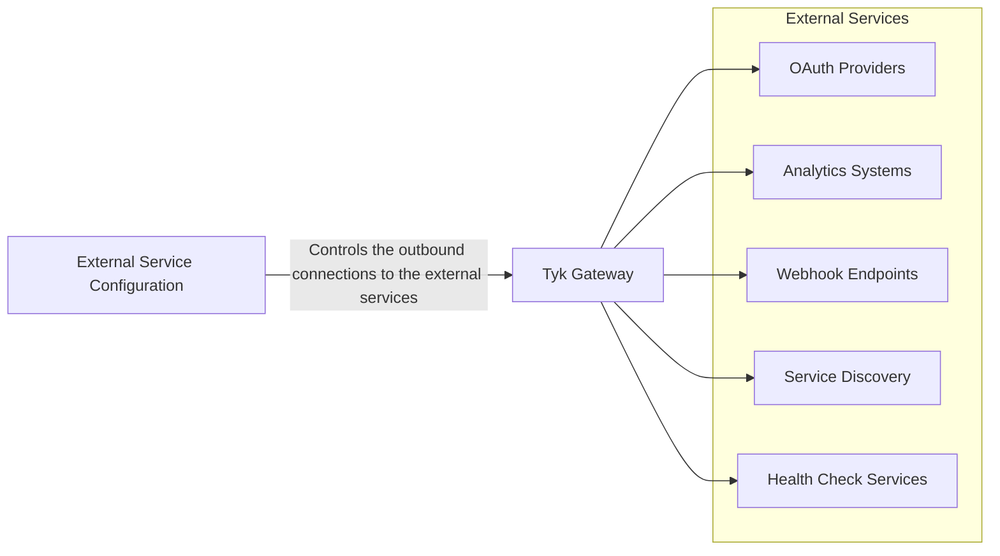

## Availability

| Component   | Version              | Editions                |
|-------------|----------------------|-------------------------|
| Tyk Gateway | Available since v5.10 | Community and Enterprise |

## Introduction



External Service Configuration gives you control over how Tyk Gateway securely connects to the [external services]() that it needs to function correctly. You can configure proxy settings, mTLS authentication, and other connection parameters for Tyk's outbound connections to services such as OAuth providers, analytics systems, and webhook endpoints.

### Key Benefits

- Enables Tyk to operate in environments with strict network policies requiring proxy usage
- Enhances security through mTLS client certificate authentication for external service connections
- Provides granular control over connection parameters for different service types
- Ensures compliance with security requirements for outbound connections

## Quick Start

<TODO: Verify this>

In this tutorial, we'll configure Tyk Gateway to use a corporate HTTP proxy for all its outbound connections.

<TODO: Add Diagram>

### Prerequisites

- Setup Tyk Self Managed using this [guide]()

### Instructions

1. **Configure External Service**

    - In the `confs/tyk.env` file, add the following environment variables:

    ```bash
    export TYK_GW_EXTERNAL_SERVICES_GLOBAL_HTTP_PROXY="http://localhost:4000"
    export TYK_GW_EXTERNAL_SERVICES_GLOBAL_HTTPS_PROXY="https://localhost:4000"
    ```

2. **Update docker compose file**
    1. Add a corporate proxy service

        We will use nginx as a corporate proxy for this example. Add the following service to your `docker-compose.yml`:

        ```yaml
        nginx-proxy:
        image: nginx:latest
        ports:
        - "4000:4000"  # Expose Redis via NGINX on port 4000
        volumes:
        - ./nginx.conf:/etc/nginx/nginx.conf:ro
        - ./logs:/var/log/nginx
        depends_on:
        - tyk-redis
        ```

    2. Add `nginx-proxy` as a dependency for `tyk-gateway` service:

        ```yaml
            depends_on:
            - nginx-proxy
        ```

3. **Restart Tyk Gateway to apply the configuration changes**
    ```bash
    docker-compose down
    docker-compose up -d
    ```
4. **Check logs to verify connections are going through the proxy**

    When the gateway starts, it establishes a connection to the Redis service through the corporate proxy (nginx). You can check the logs of the `nginx-proxy` container to verify that the connections are being routed through it:

    ```bash
    docker-compose logs -f nginx-proxy
    ```

    <TODO: Add sample log output>

## Configuration Options

External Service Configuration is defined in the `external_services` section of the Gateway `tyk.conf` file. Below are the configuration options available:



```json
{
// Partial config from tyk.conf
    "external_services": {
      "global": {
        "enabled": true,
        "http_proxy": "http://localhost:3128",
        "https_proxy": "http://localhost:3128",
        "bypass_proxy": "localhost,127.0.0.1,.internal,*.local"
      },
      "oauth": {
        "proxy": {
          "enabled": true,
          "http_proxy": "http://localhost:3128"
        },
        "mtls": {
          "enabled": true,
          "cert_file": "/etc/tyk/certs/oauth-client.crt",
          "key_file": "/etc/tyk/certs/oauth-client.key",
          "ca_file": "/etc/tyk/certs/oauth-ca.crt",
          "insecure_skip_verify": false,
          "tls_min_version": "1.2",
          "tls_max_version": "1.3"
        }
      },
      "storage": {
      },
      "webhooks": {
      },
      "health": {
      },
      "discovery": {
      },
    }
// ... more config follows
}
```



All configuration options support environment variable overrides with the prefix `TYK_GW_EXTERNAL_SERVICES_`:

```bash
# Global proxy settings
export TYK_GW_EXTERNAL_SERVICES_GLOBAL_HTTP_PROXY="http://localhost:3128"
export TYK_GW_EXTERNAL_SERVICES_GLOBAL_HTTPS_PROXY="http://localhost:3128"
export TYK_GW_EXTERNAL_SERVICES_GLOBAL_NO_PROXY="localhost,127.0.0.1"

# OAuth-specific settings
export TYK_GW_EXTERNAL_SERVICES_OAUTH_MTLS_ENABLED="true"
export TYK_GW_EXTERNAL_SERVICES_OAUTH_MTLS_CERT_FILE="/etc/tyk/certs/oauth-client.crt"
export TYK_GW_EXTERNAL_SERVICES_OAUTH_MTLS_KEY_FILE="/etc/tyk/certs/oauth-client.key"
```



Refer to the [Tyk Gateway Configuration Reference]() for more details on this setting.

### Supported External Services

| Service Type | Description | Components |
|--------------|-------------|------------|
| `oauth` | [OAuth/JWT token validation and introspection]() | JWT auth interactions with Auth Server (Identity Provider) |
| `storage` | [External storage operations]() | Redis connections, database interactions |
| `webhooks` | [Webhook event notifications]() | Event handlers, notification delivery |
| `health` | [Health check requests]() | Host checker, uptime monitoring |  
| `discovery` | [Service discovery requests]() | Load balancer, service registry |

### Hierarchy and Precedence

Settings are applied in the following priority order (highest to lowest):

1. **Service-specific configuration** - Overrides all other settings
2. **Global external_services configuration** - Applies to all services  
3. **Environment variables** - Used when proxy is enabled but no specific URLs are configured
4. **Default settings** - Built-in fallback values

### Configuration Examples

#### 1. Basic Proxy Setup (Local Testing)
```json
{
  "external_services": {
    "global": {
      "enabled": true,
      "http_proxy": "http://localhost:3128",
      "https_proxy": "http://localhost:3128",
      "bypass_proxy": "localhost,127.0.0.1,.internal"
    }
  }
}
```

#### 2. OAuth with Dedicated Proxy and mTLS (File-based)
```json
{
  "external_services": {
    "global": {
      "enabled": true,
      "http_proxy": "http://localhost:3128",
      "https_proxy": "http://localhost:3128",
      "bypass_proxy": "localhost,127.0.0.1"
    },
    "oauth": {
      "proxy": {
        "enabled": true,
        "http_proxy": "http://localhost:3129",
        "https_proxy": "http://localhost:3129"
      },
      "mtls": {
        "enabled": true,
        "cert_file": "/etc/tyk/certs/oauth-client.crt",
        "key_file": "/etc/tyk/certs/oauth-client.key",
        "ca_file": "/etc/tyk/certs/oauth-ca.crt",
        "tls_min_version": "1.2"
      }
    }
  }
}
```

#### 2a. OAuth with Certificate Store and mTLS
```json
{
  "external_services": {
    "global": {
      "enabled": true,
      "http_proxy": "http://localhost:3128",
      "https_proxy": "http://localhost:3128",
      "bypass_proxy": "localhost,127.0.0.1"
    },
    "oauth": {
      "proxy": {
        "enabled": true,
        "http_proxy": "http://localhost:3129",
        "https_proxy": "http://localhost:3129"
      },
      "mtls": {
        "enabled": true,
        "cert_id": "oauth-client-cert",
        "ca_cert_ids": ["oauth-ca-cert"],
        "tls_min_version": "1.2"
      }
    }
  }
}
```

#### 3. Mixed Environment and Service-Specific Configuration
```json
{
  "external_services": {
    "global": {
      "enabled": true,
      "http_proxy": "http://localhost:3128",
      "https_proxy": "http://localhost:3128",
      "bypass_proxy": "localhost,127.0.0.1,redis"
    },
    "storage": {
      "proxy": {
        "enabled": true,
        "bypass_proxy": "localhost,127.0.0.1,redis.internal"
      },
      "mtls": {
        "enabled": true,
        "cert_file": "/etc/tyk/certs/redis-client.crt",
        "key_file": "/etc/tyk/certs/redis-client.key"
      }
    },
    "webhooks": {
      "proxy": {
        "enabled": true,
        "http_proxy": "http://localhost:3130",
        "https_proxy": "http://localhost:3130"
      }
    }
  }
}
```

#### 4. Production Enterprise Configuration
```json
{
  "external_services": {
    "global": {
      "enabled": true,
      "http_proxy": "http://proxy.company.com:8080",
      "https_proxy": "http://proxy.company.com:8080",
      "bypass_proxy": "localhost,127.0.0.1,.company.internal"
    },
    "oauth": {
      "mtls": {
        "enabled": true,
        "cert_file": "/etc/tyk/certs/oauth-client.crt",
        "key_file": "/etc/tyk/certs/oauth-client.key",
        "ca_file": "/etc/tyk/certs/company-ca.crt",
        "insecure_skip_verify": false,
        "tls_min_version": "1.2"
      }
    },
    "webhooks": {
      "proxy": {
        "enabled": true
      },
      "mtls": {
        "enabled": true,
        "cert_file": "/etc/tyk/certs/webhook-client.crt",
        "key_file": "/etc/tyk/certs/webhook-client.key"
      }
    }
  }
}
```

#### 5. Production Certificate Store Configuration
```json
{
  "external_services": {
    "global": {
      "enabled": true,
      "http_proxy": "http://proxy.company.com:8080",
      "https_proxy": "http://proxy.company.com:8080",
      "bypass_proxy": "localhost,127.0.0.1,.company.internal"
    },
    "oauth": {
      "mtls": {
        "enabled": true,
        "cert_id": "oauth-client-prod",
        "ca_cert_ids": ["oauth-ca-prod", "intermediate-ca"],
        "tls_min_version": "1.2"
      }
    },
    "storage": {
      "mtls": {
        "enabled": true,
        "cert_id": "redis-client-prod",
        "ca_cert_ids": ["redis-ca-prod"]
      }
    },
    "webhooks": {
      "mtls": {
        "enabled": true,
        "cert_id": "webhook-client-prod",
        "ca_cert_ids": ["webhook-ca-prod"]
      }
    }
  }
}
```

### Performance Optimization

#### Connection Pooling

Tyk implements optimized connection pooling for each service type:

| Service Type | Max Connections | Per Host | Idle Timeout | Reasoning |
|--------------|-----------------|----------|--------------|-----------|
| OAuth | 50 | 10 | 30s | Frequent auth requests, connection reuse |
| Health | 20 | 5 | 15s | Quick, frequent health checks |
| Storage | 50 | 15 | 90s | Longer-lived connections, bulk operations |
| Discovery | 30 | 5 | 20s | Service registry lookups |
| Webhooks | 50 | 10 | 30s | Reliable delivery, connection reuse |

#### Service-Specific Timeouts

| Service Type | Client Timeout | Purpose |
|--------------|----------------|---------|
| OAuth | 15 seconds | Quick authentication responses |
| Health | 10 seconds | Fast health check responses |
| Discovery | 10 seconds | Quick service discovery |
| Storage | 20 seconds | Storage operation variability |
| Webhooks | 30 seconds | Reliable delivery with timeout |

## Migration from Legacy Configuration

Before the introduction of the External Service Configuration feature, Tyk Gateway used various scattered configuration settings to control connections to external services. These settings were spread across different sections of the `tyk.conf` file, making it difficult to maintain a consistent approach to external connectivity. This section guides you through migrating from these legacy configurations to the new consolidated External Service Configuration.

### Backward Compatibility

The External Services Configuration maintains full backward compatibility:

| Legacy Setting | New Location | Migration Required |
|----------------|--------------|-------------------|
| `http_proxy` | `external_services.proxy.http_proxy` | Optional |
| `https_proxy` | `external_services.proxy.https_proxy` | Optional |
| `jwt_ssl_insecure_skip_verify` | `external_services.oauth.mtls.insecure_skip_verify` | Recommended |

### Migration Strategy

**Phase 1: Assessment**
1. Backup current configuration
2. Identify existing proxy settings
3. Document current external service dependencies

**Phase 2: Gradual Migration**
1. Add `external_services` section alongside existing settings
2. Test in staging environment
3. Validate all external service functionality

**Phase 3: Optimization**
1. Add service-specific configurations
2. Implement mTLS where appropriate
3. Optimize proxy settings per service

**Phase 4: Cleanup (Optional)**
1. Remove legacy settings
2. Validate production deployment
3. Update documentation

### Migration Example

**Before:**
```json
{
  "http_proxy": "http://localhost:3128",
  "jwt_ssl_insecure_skip_verify": true
}
```

**After:**
```json
{
  "external_services": {
    "global": {
      "enabled": true,
      "http_proxy": "http://localhost:3128",
      "https_proxy": "http://localhost:3128"
    },
    "oauth": {
      "mtls": {
        "enabled": true,
        "cert_file": "/etc/tyk/certs/oauth-client.crt",
        "key_file": "/etc/tyk/certs/oauth-client.key",
        "insecure_skip_verify": false
      }
    }
  }
}
```


## Glossary

### External Service

In the context of Tyk Gateway, an **External Service** refers to any third-party system or service that Tyk Gateway itself needs to connect to as part of its operation. These are outbound connections initiated by Tyk Gateway to fulfill its functionality, as opposed to the inbound API requests that Tyk Gateway receives and processes.

**Example OAuth Providers**: 

External identity providers or authorization servers that Tyk connects to for validating tokens, retrieving JWKs (JSON Web Key Sets), or performing token introspection
   - Example: Connecting to Auth0 to validate JWT tokens
   - Example: Retrieving JWK sets from Okta


**Important Note**

<b>External Services</b> are not the same as the <b>upstream services</b> to which your APIs proxy. With Tyk, API definitions determine how client requests are proxied to upstream services; the External Service Configuration determines how Tyk itself connects to supporting infrastructure.

- When a client requests an API hosted on Tyk, the request is proxied to an upstream service based on the API definition
- When Tyk needs to validate a JWT token, it might connect to an external OAuth provider using the External Service Configuration



## FAQ

<details> <summary><b>Can I use different proxies for different service types?</b></summary>

Yes, you can configure service-specific proxy settings that override the global settings.

</details> 

<details> <summary><b>Does External Service Configuration affect incoming API requests?</b></summary>

No, it only affects outbound connections that Tyk itself initiates.

</details> 

<details> <summary><b>Can I use environment variables for proxy configuration?</b></summary>

Yes, set `use_environment: true` to read proxy settings from HTTP_PROXY, HTTPS_PROXY, and NO_PROXY environment variables.

</details> 

<details> <summary><b>How do I troubleshoot connection issues?</b></summary>

Enable debug logging in Tyk and check for proxy-related log messages.

</details> 

<details> <summary><b>Difference between External Service Configuration and Normal API Definition?</b></summary>

The difference between **External Service Configuration** and Normal **API Definition** is about **who initiates the connection**:

1. **External Service Configuration:** Controls connections that Tyk initiates to external services as part of its internal operations, such as:
   - Retrieving a JWKS from an external OAuth server (Identity Provider)
   - Sending analytics data to storage

2. **API Definition:** Controls how Tyk handles connections initiated by clients to your services (both the client-gateway and gateway-upstream connections)

Think of External Service Configuration as configuring Tyk's own HTTP client behavior, while API definitions configure Tyk's HTTP server behavior. They operate at different layers of the system.

External Service Configuration gives you control over how Tyk makes its own outbound connections, allowing it to work properly in environments with strict network policies or security requirements.

</details> 


