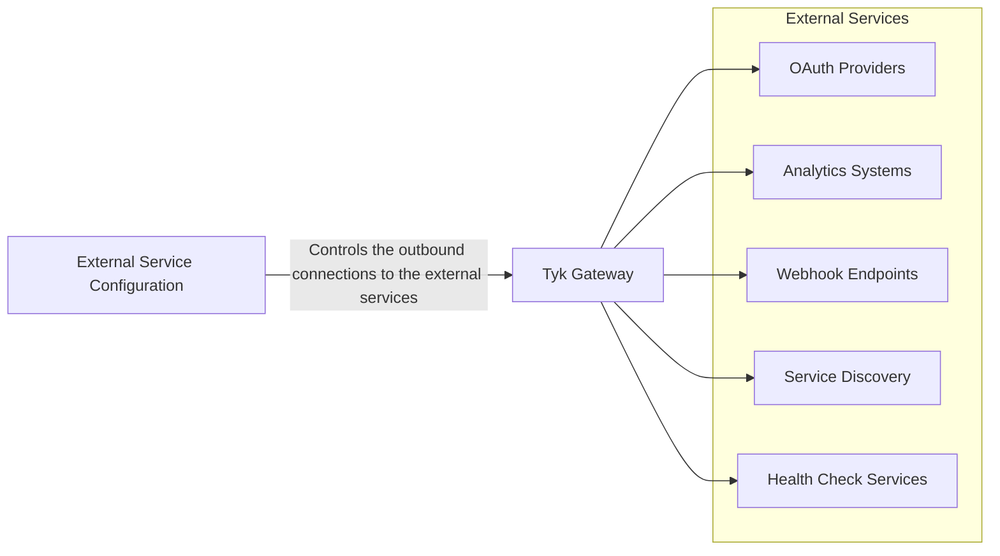

## Availability

| Component   | Version              | Editions                |
|-------------|----------------------|-------------------------|
| Tyk Gateway | Available since v5.10 | Community and Enterprise |

## Introduction



External Service Configuration gives you control over how Tyk Gateway securely connects to the [external services]() that it needs to function correctly. You can configure proxy settings, mTLS authentication, and other connection parameters for Tyk's outbound connections to services such as OAuth providers, analytics systems, and webhook endpoints.

### Key Benefits

- Enables Tyk to operate in environments with strict network policies requiring proxy usage
- Enhances security through mTLS client certificate authentication for external service connections
- Provides granular control over connection parameters for different service types
- Ensures compliance with security requirements for outbound connections

## Quick Start

<TODO: Verify this>

In this tutorial, we'll configure Tyk Gateway to use a corporate HTTP proxy for all its outbound connections.

<TODO: Add Diagram>

### Instructions

1. **Clone the repository**

    ```
    git clone https://github.com/TykTechnologies/tyk-self-managed-trial && cd tyk-self-managed-trial
    ```

2. **Update docker compose file**
    1. Add a corporate proxy service

        We will use nginx as a corporate proxy for this example. Add the following service to your `docker-compose.yml`:

        ```yaml
        nginx-proxy:
        image: nginx:latest
        ports:
        - "4000:4000"  # Expose Redis via NGINX on port 4000
        volumes:
        - ./nginx.conf:/etc/nginx/nginx.conf:ro
        - ./logs:/var/log/nginx
        depends_on:
        - tyk-redis
        ```

    2. Add `nginx-proxy` as a dependency for `tyk-gateway` service:

        ```yaml
        depends_on:
        - nginx-proxy
        ```

3. **Configure External Service**

    In the `confs/tyk.env` file, add the following environment variables:

    ```bash
    TYK_GW_EXTERNAL_SERVICES_GLOBAL_HTTP_PROXY="http://localhost:4000"
    TYK_GW_EXTERNAL_SERVICES_GLOBAL_HTTPS_PROXY="https://localhost:4000"
    ```

3. **Start the Tyk stack**

    ```
    docker compose up -d
    ```
    
    Once all containers are running, you can verify their status with:

    ```
    docker compose ps
    ```

    

    You should see all services listed as "Up".

4. **Check logs to verify connections are going through the proxy**

    When the gateway starts, it establishes a connection to the Redis service through the corporate proxy (nginx). You can check the logs of the `nginx-proxy` container to verify that the connections are being routed through it:

    ```bash
    docker-compose logs -f nginx-proxy
    ```

    <TODO: Add sample log output>

## Configuration Options

External Service Configuration allows you to control how Tyk Gateway connects to external services like OAuth providers, storage systems, and webhooks. This section explains the configuration structure and available options.

The configuration is organized into two levels:

1. **Global settings** - Apply to all service types unless overridden
2. **Service-specific settings** - Override global settings for particular service types

All settings are defined in the `external_services` section of the Gateway `tyk.conf` file.


### Global Configuration

Global settings apply to all external service connections unless overridden by service-specific settings.

| Option | Type | Required | Description |
|--------|------|----------|-------------|
| `enabled` | Boolean | Yes | Activates global proxy settings for all services |
| `http_proxy` | String | No | HTTP proxy URL for HTTP requests (e.g., "http://localhost:3128") |
| `https_proxy` | String | No | HTTPS proxy URL for HTTPS requests (e.g., "https://localhost:3128") |
| `bypass_proxy` | String | No | Comma-separated list of hosts to bypass proxy (e.g., "localhost,127.0.0.1,.internal") |

#### Example Configuration



```json
{
// Partial config from tyk.conf
    "external_services": {
      "global": {
        "enabled": true,
        "http_proxy": "http://proxy.example.com:8080",
        "https_proxy": "https://proxy.example.com:8080",
        "no_proxy": "localhost,127.0.0.1,.internal,*.local"
      }
    }
// ... more config follows
}
```



All configuration options support environment variable overrides with the prefix `TYK_GW_EXTERNAL_SERVICES_`:

```bash
export TYK_GW_EXTERNAL_SERVICES_GLOBAL_ENABLED="true"
export TYK_GW_EXTERNAL_SERVICES_GLOBAL_HTTP_PROXY="http://proxy.example.com:8080"
export TYK_GW_EXTERNAL_SERVICES_GLOBAL_HTTPS_PROXY="https://proxy.example.com:8080"
export TYK_GW_EXTERNAL_SERVICES_GLOBAL_NO_PROXY="localhost,127.0.0.1,.internal,*.local"
```



Refer to the [Tyk Gateway Configuration Reference]() for more details on this setting.

### Service-Specific Configuration

Tyk supports service-specific configurations for the following service types:

| Service Type | Description | Components |
|--------------|-------------|------------|
| `oauth` | [OAuth/JWT token validation and introspection]() | JWT auth interactions with Auth Server (Identity Provider) |
| `storage` | [External storage operations]() | Redis connections, database interactions |
| `webhooks` | [Webhook event notifications]() | Event handlers, notification delivery |
| `health` | [Health check requests]() | Host checker, uptime monitoring |  
| `discovery` | [Service discovery requests]() | Load balancer, service registry |

Each service type supports the following configuration sections:

#### Proxy Configuration

Service-specific proxy settings override global proxy settings.

| Option | Type | Required | Description |
|--------|------|----------|-------------|
| `enabled` | Boolean | Yes | Activates proxy settings for this service |
| `http_proxy` | String | No | HTTP proxy URL for this service |
| `https_proxy` | String | No | HTTPS proxy URL for this service |
| `bypass_proxy` | String | No | Comma-separated list of hosts to bypass proxy for this service |

#### Mutual TLS (mTLS) Configuration

mTLS settings enable client certificate authentication for secure connections.

| Option | Type | Required | Description |
|--------|------|----------|-------------|
| `enabled` | Boolean | Yes | Activates mTLS for this service |
| `cert_file` | String | No* | Path to client certificate file |
| `key_file` | String | No* | Path to client private key file |
| `ca_file` | String | No | Path to CA certificate file for server verification |
| `cert_id` | String | No* | Certificate ID from Tyk certificate store |
| `ca_cert_ids` | Array | No | Array of CA certificate IDs from Tyk certificate store |
| `insecure_skip_verify` | Boolean | No | Skip server certificate verification (default: false) |
| `tls_min_version` | String | No | Minimum TLS version (e.g., "1.2", default: "1.2") |
| `tls_max_version` | String | No | Maximum TLS version (e.g., "1.3", default: "1.3") |

> Either file-based configuration (`cert_file`/`key_file`) or certificate store configuration (`cert_id`) must be provided when mTLS is enabled. For mTLS, certificate store configuration (cert_id) takes precedence over file-based configuration (cert_file/key_file) if both are provided.

#### Example Configuration



```json
{
// Partial config from tyk.conf
    "external_services": {
      "oauth": {
        "proxy": {
          "enabled": true,
          "http_proxy": "http://oauth-proxy.example.com:8080",
          "https_proxy": "https://oauth-proxy.example.com:8080",
          "no_proxy": "localhost,127.0.0.1,auth.internal"
        },
        "mtls": {
          "enabled": true,
          "cert_file": "/etc/tyk/certs/oauth-client.crt",
          "key_file": "/etc/tyk/certs/oauth-client.key",
          "ca_file": "/etc/tyk/certs/oauth-ca.crt",
          "insecure_skip_verify": false,
          "tls_min_version": "1.2"
        }
      }
    }
// ... more config follows
}
```



All configuration options support environment variable overrides with the prefix `TYK_GW_EXTERNAL_SERVICES_`:

```bash
# OAuth proxy settings
export TYK_GW_EXTERNAL_SERVICES_OAUTH_PROXY_ENABLED="true"
export TYK_GW_EXTERNAL_SERVICES_OAUTH_PROXY_HTTP_PROXY="http://oauth-proxy.example.com:8080"
export TYK_GW_EXTERNAL_SERVICES_OAUTH_PROXY_HTTPS_PROXY="https://oauth-proxy.example.com:8080"
export TYK_GW_EXTERNAL_SERVICES_OAUTH_PROXY_NO_PROXY="localhost,127.0.0.1,auth.internal"

# OAuth mTLS settings
export TYK_GW_EXTERNAL_SERVICES_OAUTH_MTLS_ENABLED="true"
export TYK_GW_EXTERNAL_SERVICES_OAUTH_MTLS_CERT_FILE="/etc/tyk/certs/oauth-client.crt"
export TYK_GW_EXTERNAL_SERVICES_OAUTH_MTLS_KEY_FILE="/etc/tyk/certs/oauth-client.key"
export TYK_GW_EXTERNAL_SERVICES_OAUTH_MTLS_CA_FILE="/etc/tyk/certs/oauth-ca.crt"
export TYK_GW_EXTERNAL_SERVICES_OAUTH_MTLS_INSECURE_SKIP_VERIFY="false"
export TYK_GW_EXTERNAL_SERVICES_OAUTH_MTLS_TLS_MIN_VERSION="1.2"
```



Refer to the [Tyk Gateway Configuration Reference]() for more details on this setting.

### Hierarchy and Precedence

Settings are applied in the following priority order (highest to lowest):

1. **Service-specific configuration** - Overrides all other settings
2. **Global external_services configuration** - Applies to all services  
3. **Standard proxy environment variables** - When proxy is enabled but no specific URLs are configured, Tyk falls back to using standard `HTTP_PROXY`, `HTTPS_PROXY`, and `NO_PROXY` environment variables. These are system-wide variables commonly used by HTTP clients to route traffic through proxy servers and are not specific to Tyk's configuration system.
4. **Default settings** - If a setting is not specified, Tyk uses sensible defaults. You can find these in the [Tyk Gateway Configuration Reference]().

### Configuration Examples

#### 1. Basic Proxy Setup (Local Testing)
```json
{
  "external_services": {
    "global": {
      "enabled": true,
      "http_proxy": "http://localhost:3128",
      "https_proxy": "https://localhost:3128",
      "bypass_proxy": "localhost,127.0.0.1,.internal"
    }
  }
}
```

**What this does:**
- Routes all external service connections through a local proxy server (port 3128)
- Bypasses the proxy for localhost, 127.0.0.1, and any domain ending with .internal
- Applies these settings globally to all service types (OAuth, webhooks, storage, etc.)

#### 2. OAuth with Dedicated Proxy and mTLS (File-based)
```json
{
  "external_services": {
    "global": {
      "enabled": true,
      "http_proxy": "http://localhost:3128",
      "https_proxy": "https://localhost:3128",
      "bypass_proxy": "localhost,127.0.0.1"
    },
    "oauth": {
      "proxy": {
        "enabled": true,
        "http_proxy": "http://localhost:3129",
        "https_proxy": "https://localhost:3129"
      },
      "mtls": {
        "enabled": true,
        "cert_file": "/etc/tyk/certs/oauth-client.crt",
        "key_file": "/etc/tyk/certs/oauth-client.key",
        "ca_file": "/etc/tyk/certs/oauth-ca.crt",
        "tls_min_version": "1.2"
      }
    }
  }
}
```

**What this does:**
- Sets a global proxy for most services (port 3128)
- Configures OAuth services to use a different dedicated proxy (port 3129)
- Enables mutual TLS for OAuth connections using file-based certificates
- Enforces minimum TLS version 1.2 for OAuth connections

#### 2a. OAuth with Certificate Store and mTLS
```json
{
  "external_services": {
    "global": {
      "enabled": true,
      "http_proxy": "http://localhost:3128",
      "https_proxy": "https://localhost:3128",
      "bypass_proxy": "localhost,127.0.0.1"
    },
    "oauth": {
      "proxy": {
        "enabled": true,
        "http_proxy": "http://localhost:3129",
        "https_proxy": "https://localhost:3129"
      },
      "mtls": {
        "enabled": true,
        "cert_id": "oauth-client-cert",
        "ca_cert_ids": ["oauth-ca-cert"],
        "tls_min_version": "1.2"
      }
    }
  }
}
```

**What this does:**
- Similar to example 2, but uses Tyk's certificate store instead of file paths
- References certificates by their IDs in the certificate store
- Allows for centralized certificate management through the Tyk Dashboard

#### 3. Mixed Environment and Service-Specific Configuration
```json
{
  "external_services": {
    "global": {
      "enabled": true,
      "http_proxy": "http://localhost:3128",
      "https_proxy": "https://localhost:3128",
      "bypass_proxy": "localhost,127.0.0.1,redis"
    },
    "storage": {
      "proxy": {
        "enabled": true,
        "bypass_proxy": "localhost,127.0.0.1,redis.internal"
      },
      "mtls": {
        "enabled": true,
        "cert_file": "/etc/tyk/certs/redis-client.crt",
        "key_file": "/etc/tyk/certs/redis-client.key"
      }
    },
    "webhooks": {
      "proxy": {
        "enabled": true,
        "http_proxy": "http://localhost:3130",
        "https_proxy": "https://localhost:3130"
      }
    }
  }
}
```

**What this does:**

- **Global configuration**: Sets a baseline proxy (port 3128) for all external services with a general bypass list that includes "redis"
- **Storage service customization**: 
  - Inherits the global proxy URLs (3128) but overrides the bypass list to include "redis.internal"
  - This allows direct connections to internal Redis instances while still routing other storage traffic through the proxy
  - Adds mTLS security specifically for Redis connections, ensuring encrypted and authenticated communication with the database
- **Webhook customization**:
  - Routes webhook traffic through a separate dedicated proxy (port 3130)

#### 4. Production Enterprise Configuration
```json
{
  "external_services": {
    "global": {
      "enabled": true,
      "http_proxy": "http://proxy.company.com:8080",
      "https_proxy": "https://proxy.company.com:8080",
      "bypass_proxy": "localhost,127.0.0.1,.company.internal"
    },
    "oauth": {
      "mtls": {
        "enabled": true,
        "cert_file": "/etc/tyk/certs/oauth-client.crt",
        "key_file": "/etc/tyk/certs/oauth-client.key",
        "ca_file": "/etc/tyk/certs/company-ca.crt",
        "insecure_skip_verify": false,
        "tls_min_version": "1.2"
      }
    },
    "webhooks": {
      "proxy": {
        "enabled": true
      },
      "mtls": {
        "enabled": true,
        "cert_file": "/etc/tyk/certs/webhook-client.crt",
        "key_file": "/etc/tyk/certs/webhook-client.key"
      }
    }
  }
}
```

**What this does:**
- **Corporate proxy integration**: 
  - Routes all external traffic through the company's central proxy server
  - Bypasses the proxy for internal company domains (.company.internal) for direct access to internal services
- **OAuth security hardening**:
  - Implements mTLS for all OAuth provider connections (JWT validation, token introspection)
  - Includes a CA certificate for validating the OAuth provider's server certificate
  - Explicitly disables insecure certificate verification (`insecure_skip_verify: false`)
  - Enforces TLS 1.2 minimum to prevent downgrade attacks
- **Webhook security**:
  - Uses the global proxy settings (inherits from global configuration)
  - Adds a separate client certificate specifically for webhook connections

#### 5. Production Certificate Store Configuration
```json
{
  "external_services": {
    "global": {
      "enabled": true,
      "http_proxy": "http://proxy.company.com:8080",
      "https_proxy": "https://proxy.company.com:8080",
      "bypass_proxy": "localhost,127.0.0.1,.company.internal"
    },
    "oauth": {
      "mtls": {
        "enabled": true,
        "cert_id": "oauth-client-prod",
        "ca_cert_ids": ["oauth-ca-prod", "intermediate-ca"],
        "tls_min_version": "1.2"
      }
    },
    "storage": {
      "mtls": {
        "enabled": true,
        "cert_id": "redis-client-prod",
        "ca_cert_ids": ["redis-ca-prod"]
      }
    },
    "webhooks": {
      "mtls": {
        "enabled": true,
        "cert_id": "webhook-client-prod",
        "ca_cert_ids": ["webhook-ca-prod"]
      }
    }
  }
}
```

**What this does:**
- Similar to example 4, but uses certificate store for all mTLS configurations
- **Certificate store integration**:
  - Instead of file paths, all certificates are referenced by IDs in Tyk's certificate store
  - This enables centralized certificate management through the Tyk Dashboard
  - Certificates can be rotated, renewed, or replaced without changing configuration files
- **Comprehensive mTLS deployment**:
  - Every service type (OAuth, storage, webhooks) has its own dedicated client certificate
  - This provides service-specific identity and enables granular access control
  - Each service also has its own CA certificate configuration for validating server certificates
- **Certificate chain support**:
  - The OAuth configuration includes multiple CA certificates (`["oauth-ca-prod", "intermediate-ca"]`)
  - This supports complex PKI setups with intermediate certificate authorities
  - Ensures proper validation of certificate chains in enterprise environments

### Performance Optimization

#### Connection Pooling

Tyk implements optimized connection pooling for each service type:

| Service Type | Max Connections | Per Host | Idle Timeout | Reasoning |
|--------------|-----------------|----------|--------------|-----------|
| OAuth | 50 | 10 | 30s | Frequent auth requests, connection reuse |
| Health | 20 | 5 | 15s | Quick, frequent health checks |
| Storage | 50 | 15 | 90s | Longer-lived connections, bulk operations |
| Discovery | 30 | 5 | 20s | Service registry lookups |
| Webhooks | 50 | 10 | 30s | Reliable delivery, connection reuse |

#### Service-Specific Timeouts

| Service Type | Client Timeout | Purpose |
|--------------|----------------|---------|
| OAuth | 15 seconds | Quick authentication responses |
| Health | 10 seconds | Fast health check responses |
| Discovery | 10 seconds | Quick service discovery |
| Storage | 20 seconds | Storage operation variability |
| Webhooks | 30 seconds | Reliable delivery with timeout |

## Migration from Legacy Configuration

Before the introduction of the External Service Configuration feature, Tyk Gateway used various scattered configuration settings to control connections to external services. These settings were spread across different sections of the `tyk.conf` file, making it difficult to maintain a consistent approach to external connectivity. This section guides you through migrating from these legacy configurations to the new consolidated External Service Configuration.

### Backward Compatibility

The External Services Configuration provides a new way to configure external service connections while maintaining compatibility with legacy settings. Here's how it works:

1. **Legacy settings continue to function**: Existing configurations using the legacy settings will continue to work without modification.

2. **Precedence rules**: When both legacy and new settings are configured with different values:
   - The new `external_services` settings take precedence over legacy settings
   - Legacy settings are only used if the corresponding new settings are not specified

3. **Migration path**: You can migrate gradually by moving settings to the new structure as needed:

| Legacy Setting | New Location | Behavior When Both Are Set |
|----------------|--------------|----------------------------|
| `http_proxy` | `external_services.global.http_proxy` | `external_services` setting takes precedence |
| `https_proxy` | `external_services.global.https_proxy` | `external_services` setting takes precedence |
| `jwt_ssl_insecure_skip_verify` | `external_services.oauth.mtls.insecure_skip_verify` | `external_services` setting takes precedence |

4. **Recommended approach**:
   - For new deployments: Use only the new `external_services` structure
   - For existing deployments: You can continue using legacy settings or gradually migrate to the new structure
   - For production environments: We recommend migrating to the new structure as it provides more flexibility and service-specific configuration options

### Migration Strategy

**Phase 1: Assessment**
1. Backup current configuration
2. Identify existing proxy settings
3. Document current external service dependencies

**Phase 2: Gradual Migration**
1. Add `external_services` section alongside existing settings
2. Test in staging environment
3. Validate all external service functionality

**Phase 3: Optimization**
1. Add service-specific configurations
2. Implement mTLS where appropriate
3. Optimize proxy settings per service

**Phase 4: Cleanup (Optional)**
1. Remove legacy settings
2. Validate production deployment
3. Update documentation

### Migration Example

**Before:**
```json
{
  "http_proxy": "http://localhost:3128",
  "jwt_ssl_insecure_skip_verify": true
}
```

**After:**
```json
{
  "external_services": {
    "global": {
      "enabled": true,
      "http_proxy": "http://localhost:3128",
      "https_proxy": "https://localhost:3128"
    },
    "oauth": {
      "mtls": {
        "enabled": true,
        "cert_file": "/etc/tyk/certs/oauth-client.crt",
        "key_file": "/etc/tyk/certs/oauth-client.key",
        "insecure_skip_verify": true
      }
    }
  }
}
```


## Glossary

### External Service

In the context of Tyk Gateway, an **External Service** refers to any third-party system or service that Tyk Gateway itself needs to connect to as part of its operation. These are outbound connections initiated by Tyk Gateway to fulfill its functionality, as opposed to the inbound API requests that Tyk Gateway receives and processes.

**Example OAuth Providers**: 

External identity providers or authorization servers that Tyk connects to for validating tokens, retrieving JWKs (JSON Web Key Sets), or performing token introspection
   - Example: Connecting to Auth0 to validate JWT tokens
   - Example: Retrieving JWK sets from Okta


**Important Note**

<b>External Services</b> are not the same as the <b>upstream services</b> to which your APIs proxy. With Tyk, API definitions determine how client requests are proxied to upstream services; the External Service Configuration determines how Tyk itself connects to supporting infrastructure.

- When a client requests an API hosted on Tyk, the request is proxied to an upstream service based on the API definition
- When Tyk needs to validate a JWT token, it might connect to an external OAuth provider using the External Service Configuration



## FAQ

<details> <summary><b>Can I use different proxies for different service types?</b></summary>

Yes, you can configure service-specific proxy settings that override the global settings.

</details> 

<details> <summary><b>Does External Service Configuration affect incoming API requests?</b></summary>

No, it only affects outbound connections that Tyk itself initiates.

</details> 

<details> <summary><b>How do I troubleshoot connection issues?</b></summary>

Enable debug logging in Tyk and check for proxy-related log messages. Look for the following patterns in your logs:

**Proxy Configuration Issues:**
```
[ExternalServices] Failed to configure proxy: invalid HTTP proxy URL: parse "http://badproxy:wrong_port": invalid port "wrong_port" after host
[ExternalServices] Failed to create JWK HTTP client
```

**Certificate/TLS Issues:**
```
[ExternalServices] Failed to configure TLS: invalid mTLS configuration: both cert_file and key_file must be specified for file-based configuration
[ExternalServices] Failed to load client certificate: open /etc/tyk/certs/oauth-client.crt: no such file or directory
[ExternalServices] Certificate not found in store: oauth-client-cert
```

**Connection Failures:**
```
error happened during the introspection call: dial tcp: lookup oauth.example.com: no such host
status does not indicate success: code: 407, body: Proxy Authentication Required
```

To enable debug logging, set `"log_level": "debug"` in your `tyk.conf` file or use the environment variable `TYK_GW_LOGLEVEL=debug`.

</details> 

<details> <summary><b>Difference between External Service Configuration and Normal API Definition?</b></summary>

The difference between **External Service Configuration** and Normal **API Definition** is about **who initiates the connection**:

1. **External Service Configuration:** Controls connections that Tyk itself initiates to external services as part of its internal operations:
   - Retrieving a JWKS from an external OAuth server (Identity Provider)
   - Sending analytics data to storage

2. **API Definition:** Controls how Tyk handles connections initiated by clients to your services (both the client-gateway and gateway-upstream connections)

Think of External Service Configuration as configuring Tyk's own HTTP client behavior, while API definitions configure Tyk's HTTP server behavior. They operate at different layers of the system.

External Service Configuration gives you control over how Tyk makes its own outbound connections, allowing it to work properly in environments with strict network policies or security requirements.

</details> 


