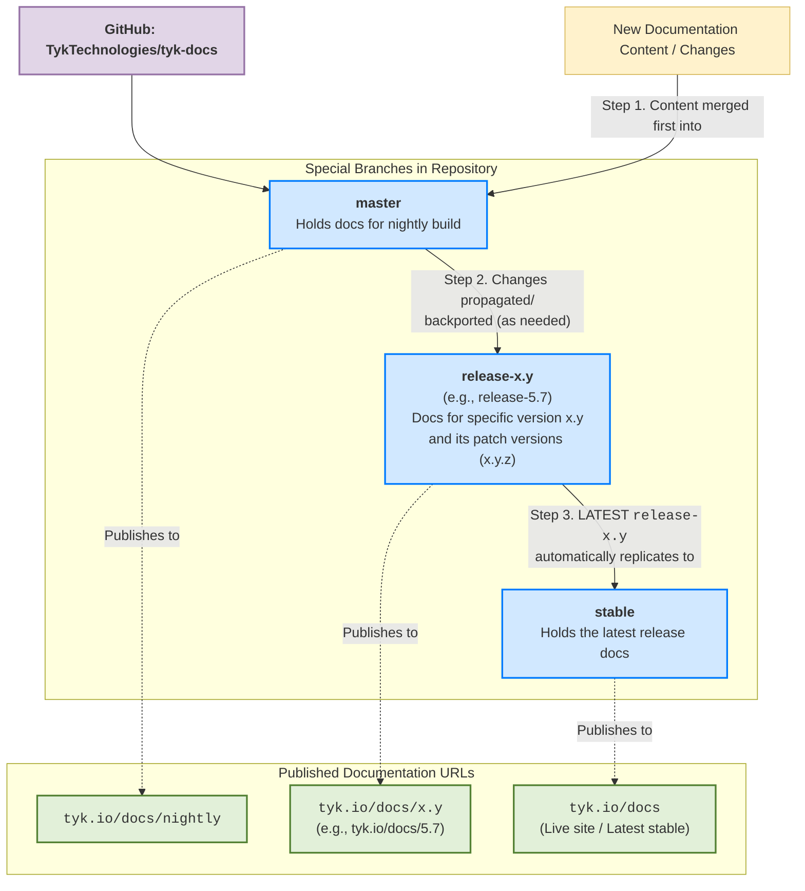

## Introduction

This document outlines the process for releasing Tyk documentation, including patch and major/minor releases. It provides a clear understanding of the versioning system, the release workflow, and the steps required to ensure that documentation is up-to-date.

## Types of Releases

Tyk has two types of releases:

1.  **Patch Release:** e.g → 5.3.5, 5.3.6, 5.7.1, 5.7.2

    A patch release includes bug fixes, small improvements, and security patches. It does not introduce any breaking changes.

2.  **Major/Minor Release:** e.g → 4.1, 4.2, 5.3, 5.4

    A major or minor release includes new features, improvements, and potentially breaking changes.

### Versioning in Tyk Docs

Tyk Docs uses a versioning system that aligns with the Tyk components. The versioning follows the Semantic Versioning of Tyk [Gateway]().

## Understanding the Release Workflow

Tyk Documentation is maintained in a [GitHub](https://github.com/TykTechnologies/tyk-docs) repository, and the release workflow is managed through branches. The following table outlines the special branches used in the Tyk Docs repository:

| **Special Branches** | **Description** | **Docs URL** |
|---------------------------|-----------------|--------------|
| `master`                  | Holds docs for nightly build. | [tyk.io/docs/nighlty](https://tyk.io/docs/nighlty) |
| `release-x.y`             | Holds docs for that specific version. For example, `release-5.7` holds docs for 5.7 and its patch versions (5.7.1, 5.7.2, etc.). | [tyk.io/docs/5.7](https://tyk.io/docs/5.7) |
| `stable`                  | Holds the latest release. | [tyk.io/docs](https://tyk.io/docs) |

Documentation is always merged into the `master` branch first, and then the changes are made to the `release-x.y` branches as needed.

The `stable` branch automatically replicates changes from the latest release branch (e.g., `release-5.7`) to ensure that the live site always reflects the most recent stable version. Because of which at [tyk.io/docs]() and [tyk.io/docs/5.7](), you will see the same content.

### Previous Releases

Tyk maintains [LTS versions](). During some releases, we need to update the LTS release alongside the latest version. For example, you might have to maintain 5.7.2 (latest) and 5.3.2 (LTS).

## Patch Release

To release a patch version, we follow a simple process that involves merging the release notes and documentation PRs into the master and the specific release branch (e.g., `release-5.7`).

### Pre-Requisites:

1. Ensure the PRs for documentation, configuration, and release notes have already been approved.

    **Note:** For release notes ensure that we have updated the Tyk component version on the [release summary page](https://tyk.io/docs/developer-support/release-notes/overview/)

2. Good understanding of the docs.json file and how it [works]() in Mintlify.

### Instructions

1.  **Deploy release: Merge RNs and Docs PRs**
    **Description:** The PRs mentioned in the prerequisites can now be merged in master and release branch (release-5.7)

2.  **Verify**
    **Description:** After merging the PRs on the version branch (release-5.7), it usually takes 5 minutes to reflect the same on the live website. Verify these changes after release.

**Note:** We can also have patch release for previous versions. For example, if the latest version is 5.7.2 and the new patch is 5.7.3, and a patch for LTS version 5.3.3 is also needs to be released, then you will have to merge the PRs for both versions.

## Major/Minor Release

To release a major or minor version, we follow a series of steps to ensure that the documentation is updated, the latest version is deployed, and the previous versions are maintained correctly. The following steps outline the process:

### Pre-Requisites:

Ensure the PRs for documentation, configuration, and release notes have already been approved.

**Note:** For release notes ensure that we have updated the Tyk component version on the [release summary page](https://tyk.io/docs/developer-support/release-notes/overview/)

### Instructions

1.  **Deploy release: Merge all RNs, Docs & Config PRs**\
    **Description:** The PRs mentioned in the prerequisites can now be merged in master.

2.  **Make the following changes in the versions.json file:**

    Example migration from 5.7 to 5.8:

    -  Rename `5.7 - Latest` to `5.7`
    -  Replicate the nighlty json object and update the version number to `5.8 - Latest`.

    Question: Will automapping will be maintained?

2.  **Create a new release branch**
    **Description:** This step creates a new branch from the master branch, which will be used to maintain the documentation for the new version. Ensure the new release branch has branch protection enabled.

3.  **Update stable branch updater**
    **Description:** We are updating a GitHub Action here. This action ensures that anything we merge into the version branch (release-5.7) is also merged into the stable branch, which directly reflects our live site.
    **Automation:** This [Github](https://github.com/TykTechnologies/tyk-docs/actions/workflows/release.yml) Action generates this page.\
    **Example**: <https://github.com/TykTechnologies/tyk-docs/pull/5377>\
    **Steps:**

    1.  Invoke this [Github Action](https://github.com/TykTechnologies/tyk-docs/actions/workflows/release.yml) with the following values. Ensure you follow the naming convention of release branches (release-x.y)

    2.  This will create 3 PRs. The one we are interested in will be named Update stable-updater.yaml to use release-5.8

    3.  Merge the PR into master, current latest till release-5. **We need to merge the PR to all the way to previous branches.**

4.  **Verify that Everything is working**\
    **Steps:**

    1.  Go to the latest [https://tyk.io/docs](https://tyk.io/docs/) URL and navigate through the docs to ensure it is not redirecting to some other URL.

    2.  Go to the previous URL, <https://tyk.io/docs/5.7>, and navigate through the docs to ensure it is not redirected to some other URL.

5. **Force Re-Index Mintlify Search? when merged to stable**

6. **Force Re-Index AI Search? when merged to stable**

7. **Update Postman Collections**\
    **Description:** We maintain a postman collection for the following Tyk Componets. After a\
    **Automation:** Not Available\
    **Steps:**\
    These instructions are for a single Tyk component and must be repeated for others.

    1.  Download the swagger from the docs website or the respective Github repository of the component.

    2.  In Postman, select the import option and drop the file you downloaded in the first step.

    3.  After the import, change the name. Refer to our previous collection name.

    4.  In the Postman documentation for a collection, you need to add an image. Copy it from the previous Postman collection.

    5.  Add the latest prefix and remove the previous one. This ensures that the latest version is always displayed at the top.

8. **Update the HubSpot Banner to indicate the release of 5.8 on old docs pages.**\
    **Description:** We use HubSpot to display a banner at the top of our docs page, which indicates that you are viewing old documentation and points to the latest version.\
    Here is a sample banner you can view on this [page](https://tyk.io/docs/4.0/getting-started/key-concepts/graphql-subscriptions/).

    **Automation:** Not Available\
    **Steps:** Inform @Jennifer Craig to release the new banner.

9. **Add a reference to release notes in Github Releases.**\
    **Description:** Developers usually refer to the release tags to view the changelog. These release tags should point to the release notes in the docs.\
    **Automation:** Not Available\
    **Steps:** Modify the release tags of all components modified in a release.\
    **Example:** <https://github.com/TykTechnologies/tyk/releases/tag/v5.3.8>

---

Due to structural changes in the documentation across versions, this cannot be done directly, and a separate PR must be created from the latest RNs and config PR. This process has to be done manually and will require the help of DX.