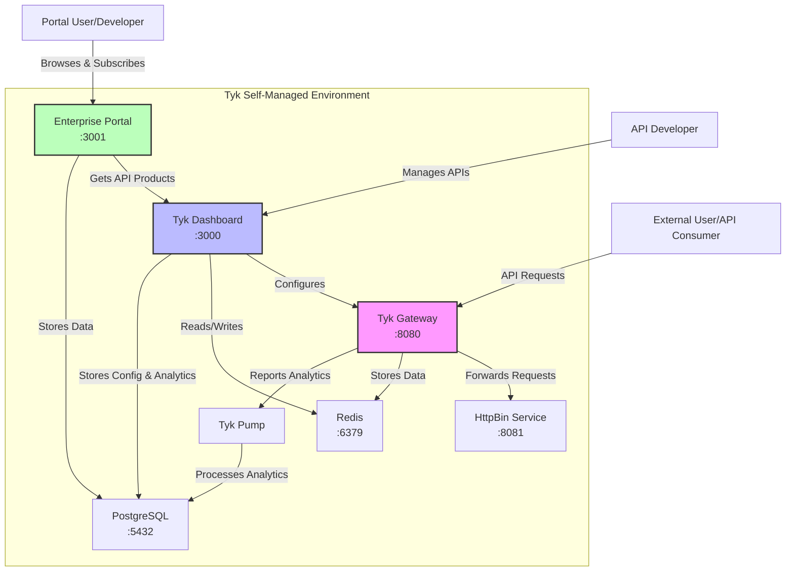

## Introduction

Tyk Self-Managed is a full-featured API management platform that you deploy and control on-premise, within your own infrastructure. This page will guide you through setting up and exploring your Self-Managed Tyk environment.

### What's included in your trial

Your Tyk Self-Managed trial includes:

- **Tyk Gateway**: The core API Gateway that handles all your API traffic
- **Tyk Dashboard**: A web interface for managing your APIs, policies, and analytics
- **Enterprise Developer Portal**: A customizable API portal to securely publish and manage API access for your consumers.
- **Analytics**: Detailed insights into API usage and performance
- **Sample APIs**: Pre-configured APIs to help you explore Tyk's capabilities

### System Requirements

- **Docker**: Docker Engine 20.10.0 or newer
- **CPU & Memory**: Minimum 2 GB RAM and 2 CPU cores
- **License Key**: A valid Tyk Self-Managed license key.

    You can quickly get started with a self-managed trial license by completing the registration on [website](https://tyk.io/self-managed-trial ). After registering, you’ll receive an email containing your license key.

    If you'd rather have guided assistance, we recommend checking out our [Tyk Technical PoC Guide](https://tyk.io/customer-engineering/poc/technical-guide/).

### Trial Duration and Limitations

Your trial license is valid for **14 days from activation**. During this period, you have access to all Enterprise features. After the trial period, you'll need to purchase a license to continue using Tyk Self-Managed.

To continue using Tyk Self-Managed after your trial, please contact our [team](https://tyk.io/contact/) to discuss licensing options.



<br>
<br>

## Quick Setup

This section provides a step-by-step guide to quickly set up Tyk Self-Managed using Docker. 

### Prerequisites

1. Install [Docker](https://docs.docker.com/get-docker/) on your system
2. Install the following CLI tools:
    - [Jq](https://stedolan.github.io/jq/download/) (for JSON processing)
    - [Git](https://git-scm.com/downloads) (for cloning Github repository)
    - [curl](https://curl.se/download.html) (for making API requests)
3. Tyk Self-Managed license key (from your trial email) 
    - If you are having issues with your trial license, please contact info@tyk.io

### Installation

1. Clone the repository:

    ```
    git clone https://github.com/munkiat/tyk-poc && cd tyk-poc
    ```

2. Create a `.env` file with your license key:

    ```
    DASH_LICENSE=<your-tyk-license-key>
    ```

    You can use the `.env.example` file as a template.

    **Note:** Files starting with a dot (.) are hidden by default in Unix-based systems. Use `ls -a` to view hidden files in your terminal.

3. Start the Tyk stack:

    ```
    docker compose up -d
    ```

    This command will download and start all the necessary containers:
    - Tyk Gateway
    - Tyk Dashboard
    - Enterprise Developer Portal
    - Redis (Gateway dependency for caching)
    - PostgreSQL (Dashboard and Portal dependency for data storage)
    - Tyk Pump (for analytics)
    - Sample API service (httpbin)

    **Wait for the containers to initialize. This may take a few minutes depending on your system.**

5. Once all containers are running, you can verify their status with:

    ```
    docker compose ps
    ```

    

    You should see all services listed as "Up".

### Default Credentials and Access Points

Once the installation is complete, you can access the following components:

```
---------------------------
Your Tyk Dashboard URL is http://localhost:3000

user: developer@tyk.io
pw: specialpassword
---------------------------
Your Tyk Gateway URL is http://localhost:8080
---------------------------
Your Developer Portal URL is http://localhost:3001

admin user: portaladmin@tyk.io
admin pw: specialpassword
---------------------------
```

### Verifying Your Installation

1. **Verify Dashboard Access**:
    1. Open your browser and navigate to `http://localhost:3000`
    2. Log in with the default credentials (developer@tyk.io / specialpassword)
    3. You should see the Tyk Dashboard with pre-configured APIs and analytics

    

2. **Verify Gateway Access**:
    1. Open a terminal and run:
    ```
    curl http://localhost:8080/hello
    ```
    2. You should receive a JSON response from the API, confirming that the Tyk Gateway is functioning correctly. 

3. **Verify Developer Portal Access**:
    1. Open your browser and navigate to `http://localhost:3001`
    2. Log in with the default credentials (portal@tyk.io / specialpassword)
    3. You should see the `Overview` section of the Developer Portal.

    

## Exploring Your Pre-Configured Environment

When you run the Docker Compose command in the previous section, several interconnected components are deployed to create a complete Tyk API Management ecosystem. Let's explore what's installed and how these components work together.

The following diagram illustrates the components of your Tyk Self-Managed installation and how they interact:

<TODO: Ask @jen to recreate the diagram with our standard colors and styles>



**Key Components:**

1. **Tyk Gateway (tyk-gateway)**: The core API Gateway that processes all API requests, applies policies, and enforces security. Exposed on port 8080.

2. **Tyk Dashboard (tyk-dashboard)**: The management interface for configuring APIs, policies, and viewing analytics. Exposed on port 3000.

3. **Enterprise Developer Portal (tyk-ent-portal)**: A customizable portal for API consumers to discover, test, and subscribe to APIs. Exposed on port 3001.

4. **Redis (tyk-redis)**: Used for caching, session management, and real-time communication between components. Exposed on port 6379.

5. **PostgreSQL (tyk-postgres)**: Stores configuration data, user information, and analytics. Exposed on port 5432.

6. **Tyk Pump (tyk-pump)**: Processes and transfers analytics data from the Gateway to the database for reporting.

7. **HttpBin (httpbin)**: A sample API service that provides various endpoints for testing. Exposed on port 8081.

With these components, you have a fully functional Tyk Self-Managed environment that allows you to manage APIs, monitor usage, and provide a developer portal for your API consumers. Let's explore how to navigate the Dashboard, understand the pre-loaded APIs, and preview the Developer Portal.

### Dashboard Tour

The Tyk Dashboard is your central hub for managing APIs, monitoring performance, and configuring security settings.



Let's explore the main sections available in the sidebar:

#### Navigating the Tyk Dashboard

Dashboard is organized into a few key categories:
* **API Management**: In API Management, you can access and edit all your APIs, create data graphs, and add webhooks.
* **API Security**: In API Security, you can manage keys, policies, and certificates to customize your security settings. 
* **User Management**: In User Management, you can control permissions and access for users and user groups. You can also create profiles that help you manage third party identity providers for specific Tyk actions like signing into the portal or logging into the dashboard.
* **Monitoring**: In Monitoring, you can view activity reports, logs, and analytics related to your APIs.
* **System Management**: In System Management, you can affect OPA rules that define fine-grained access control for managing and enforcing permissions on various actions and resources in Tyk’s API management system.
* **Classic Portal**: In Classic Portal, you can affect permissions and configurations related to your developer portal. The Tyk Developer Portal is a platform that enables you to publish, manage, and promote your APIs to external developers.


For a comprehensive guide to the Dashboard, refer to the [using Tyk Dashboard]() guide.

#### Understanding the Pre-loaded APIs

Your trial environment comes with pre-configured sample APIs to help you explore Tyk's capabilities:

**1. httpbingo API Overview:**

- **Purpose**: A test API with various endpoints for exploring API management features
- **Base URL**: `http://localhost:8080/httpbingo`
- **Authentication**: API Key authentication (via Authorization header)
- **Rate Limiting**: Configured through policies (Sandbox and Production plans)

**Key Endpoints:**

- `/get`: Returns request data (headers, query parameters)
- `/headers`: Shows all request headers
- `/ip`: Returns the client's IP address
- `/xml`: Demonstrates response transformation (XML to JSON)
- `/status/{code}`: Returns specified HTTP status code
- `/mock`: Returns a mock response generated by Tyk

**2. F1 API Overview:**

- **Purpose**: Demonstrates JWT authentication with a real-world API providing Formula 1 racing data
- **Base URL**: `http://localhost:8080/f1api` (proxies to https://f1api.dev/api/)
- **Authentication**: JWT HMAC authentication

   JWT Authentication Details:

   - **Shared Secret**: `topspecial256sharedbitlongsecret`
   - **JWT Generation**: You can use [jwt.io](https://jwt.io) to generate valid tokens
   - **Header Format**: `Authorization: Bearer <your_jwt_token>`
- **Rate Limiting**: 4 requests per 15 seconds (configured through policy)

**Key Endpoints:**

- `/drivers`: Information about F1 drivers
- `/seasons`: Data about F1 racing seasons
- `/circuits`: Details about F1 racing circuits
- `/teams`: Information about F1 teams

To explore these APIs in detail:

1. In the Dashboard, go to the "APIs" section
2. Click on either "httpbingo API" or "F1 API"
3. Navigate through the tabs to see the various configuration options
4. Pay special attention to the `Endpoint Designer` tab to see how individual endpoints are configured

### (TODO: WIP) Enterprise Developer Portal Preview

The Enterprise Developer Portal provides a dedicated space for API consumers to discover, learn about, and subscribe to your APIs. It bridges the gap between API providers and consumers.



As an administrator, you can customize the portal's appearance, content, and behavior to match your brand and requirements.

#### Exploring Available API Products and Catalogs

The Developer Portal organizes APIs into a structured hierarchy:

**Products, Plans, and Catalogs:**

- **Products**: API offerings that developers can consume. In your trial, there's a pre-configured product for the httpbingo API.

- **Plans**: Subscription tiers with different access levels and rate limits. Your trial includes:
  - **Sandbox Plan**: Limited rate (3 requests per 10 seconds) for testing and development
  - **Production Plan**: Higher capacity (100 requests per 60 seconds) for production use

- **Catalogs**: Collections of products and plans that can be made available to different audiences. Your trial has a public catalog containing the httpbingo API product and both plans.

**Exploring as a Developer:**

To experience the portal from a developer's perspective:

1. Register a new developer account (or use the admin account to view the developer experience)
2. Browse the API catalog to see available products
3. View the API documentation, which is automatically generated from the API definition
4. Subscribe to a plan to get access credentials
5. Test the API using the provided examples and your credentials

The Developer Portal streamlines the onboarding process for API consumers, making it easy for them to find, understand, and use your APIs.


## Core API Management Capabilities

In this section, we will explore the core API management capabilities of Tyk Self-Managed using the pre-configured APIs.

We will explore how to your secure APIs, manage API traffic, and monitor your API usage. The following sections will guide you through the key features of Tyk API Management platform.

### API Security in Action

API security is an important aspect of API management. Tyk provides [multiple authentication methods]() to secure your APIs and control access. In this section, we'll explore the security features available in your trial environment.

#### Exploring Authentication Methods

Tyk supports various authentication methods including [Auth Token](), [JWT](), [OAuth 2.0](), and [more](). In your trial environment, the httpbingo API is pre-configured with Auth Token authentication.

[Auth Token]() is the simplest form of authentication. They're easy to implement and understand, making them perfect for your first exploration of Tyk.

1. **Create an API Key:**
   - In the Dashboard, navigate to the "Keys" section in the left menu
   - Click the "ADD KEY" button
   - Under "Access Rights," select the `HTTPBIN API Access` policy
   - Now under the "Configuration" tab, add an alias `httpbin`
   - Click "CREATE" to generate your API key
   
      

   - Copy the displayed API `key ID` for testing
      
      **Note:** This key will be used in the upcoming sections to authenticate requests to the httpbingo API.

2. **Test API Access with Your Key:**
   - Open a terminal or API client like Postman
   - Make a request to the API including your key in the Authorization header:
     ```
     curl -H "Authorization: <your-api-key>" http://localhost:8080/httpbingo/get
     ```
   - You should receive a successful response with details about your request

3. **Try Without Authentication:**
   - Make the same request without the Authorization header:
     ```
     curl http://localhost:8080/httpbingo/get
     or
     curl -H "Authorization: invalid-key" http://localhost:8080/httpbingo/get
     ```
   - You should receive an "Unauthorized" error, confirming that authentication is working

**TODO: (Is this enough? or should I add JWT Demo as well?)**

#### Rate Limiting and Quota Management

[Rate limiting]() is a technique that allows you to control the rate at which clients can consume your APIs and is one of the fundamental aspects of managing traffic to your services. It serves as a safeguard against abuse, overloading, and denial-of-service attacks by limiting the rate at which an API can be accessed.

In this section we will implement and test rate limiting in Tyk.

**Testing Rate Limiting:**

1. **Create an API Key:**
   - In the Dashboard, navigate to the "Keys" section in the left menu
   - Click the "ADD KEY" button
   - Under "Access Rights," select the `HTTPBIN API Access` policy
   - Under "Key Global Limits and Quota" set the following:
     - **Requests**: 3 requests
     - **Per (seconds):**: 10 seconds
   - Now under the "Configuration" tab, add an alias `httpbin rate limit`
   - Click "CREATE" to generate your API key
   
      

   - Copy the displayed API `key ID` for testing

2. **Observe Rate Limiting in Action:**
   - Open a terminal and run multiple requests in quick succession:
     ```
     for i in {1..5}; do curl -H "Authorization: <your-api-key>" http://localhost:8080/httpbingo/get; echo -e "\n--- Request $i completed ---\n"; done
     ```
   - After the third request within 10 seconds, you should see a rate limit exceeded error
       ```json
         {
            "error": "Rate Limit Exceeded"
         }
       ```

3. **Compare with a Higher Limit:**
   - Now update the `httpbin rate limit` key and set a value of `100` in the "requests" section of rate limiting.
   - Run the same test and observe that you can make more requests before hitting limits

4. **Clean Up**
   - After testing, you can delete the `httpbin rate limit` API key from the Dashboard.

By exploring these security features, you'll gain a solid understanding of how Tyk helps protect your APIs while providing the right level of access to authorized consumers.

### Traffic Control & Transformation

Tyk API [Gateway]() can control and transform incoming API traffic. It provides [various mechanisms]() to modify requests and responses, control traffic flow, and optimize performance. Let's explore these capabilities in your trial environment.

#### Testing Request/Response Transformations

Transformations allow you to modify API requests and responses without changing your backend services. This is useful for adapting legacy APIs, standardizing formats, or enhancing responses.

The httpbingo API in your trial includes a pre-configured transformation on the `/xml` endpoint that converts XML responses to JSON format.

**Testing the XML to JSON Transformation:**

1. **Access the XML Endpoint Directly:**
   - Before testing the transformation, you can access the XML endpoint (httpbin) directly to see the raw XML response:
     ```
     curl http://localhost:8081/xml
     ```
   - You should see an XML response from the backend service

1. **Make a Request to the XML Endpoint:**
   - Using your API key from the previous section, make a request to the XML endpoint (on the Tyk Gateway):
     ```
     curl -s -H "Authorization: <your-api-key>" http://localhost:8080/httpbingo/xml | jq
     ```
   - Notice that even though the backend returns XML, you receive a JSON response
   - This transformation happens in the gateway, not in the backend service

2. **Examine the Transformation Configuration:**
   - In the Dashboard, go to the "APIs" section
   - Click on the httpbingo API
   - Navigate to the "Endpoint Designer" tab
   - Find the `/xml` path and click on it
   - You'll see the response transformation that converts XML to JSON

   

Transformations are a powerful way to adapt APIs to your needs without modifying backend code, making them ideal for modernizing legacy services or standardizing API responses across different systems.

#### Exploring Caching Configurations

Caching improves API performance by storing responses and serving them without hitting your backend services for every request. This reduces latency and backend load.

**Understanding API Caching:**

The httpbingo API includes a caching example on the `/get` endpoint with a 10-second cache lifetime. This means that repeated requests within 10 seconds will receive the same cached response.

**Testing Caching Behavior:**

1. **Make an Initial Request with a Unique Value:**
   - Using your API key, make a request to the endpoint with a unique Unique-Header:
     ```
     curl -s -H "Authorization: <your-api-key>" \
          -H "Unique-Header: $(uuidgen)" \
          http://localhost:8080/httpbingo/get | jq '.headers["Unique-Header"]'
     ```
   - You'll see the Unique-Header value in the response, for example:
     ```
     [
       "62ACF2DD-9116-4B4B-B80E-5F8538C12957"
     ]
     ```
   - The httpbingo service echoes back the headers it receives, including your unique Unique-Header

2. **Make an Immediate Second Request with a Different Header Value:**
   - Immediately make another request with a new unique header value:
     ```
     curl -s -H "Authorization: <your-api-key>" \
          -H "Unique-Header: $(uuidgen)" \
          http://localhost:8080/httpbingo/get | jq '.headers["Unique-Header"]'
     ```
   - Notice that the Unique-Header value in the response is identical to the first request
   - This confirms you're receiving a cached response, not a new one from the backend
   - Even though you sent a different header value in your request, you got back the same header value from the first request because the response was cached

3. **Wait and Test Again:**
   - Wait 11 seconds (just past the 10-second cache lifetime)
   - Make another request with a new unique value
     ```
     curl -s -H "Authorization: <your-api-key>" \
          -H "Unique-Header: $(uuidgen)" \
          http://localhost:8080/httpbingo/get | jq '.headers["Unique-Header"]'
     ```
   - You should see a different Unique-Header value in the response, matching your new request
   - This indicates the cache has expired and you're getting a fresh response from the backend

Caching is particularly valuable for responses that are expensive to generate but don't change frequently. By implementing appropriate caching strategies, you can significantly improve API performance and reduce backend load.

### API Monitoring & Analytics

Understanding how your APIs are performing is important for optimizing performance, planning capacity, and ensuring security. Tyk provides comprehensive analytics and monitoring tools to give you visibility into your API traffic.

#### Generating Test Traffic

To explore Tyk's analytics capabilities, you'll need to generate some API traffic that simulates real-world usage patterns and populates the analytics dashboard.

**Creating Test Traffic:**

1. **Using Command Line Tools:**
   - You can use simple bash loops to generate multiple requests:
     ```
     for i in {1..20}; do curl -H "Authorization: <your-api-key>" http://localhost:8080/httpbingo/get; sleep 0.5; done
     ```
   - This sends 20 requests with a half-second delay between each

2. **Generating Diverse Traffic:**
   - Try accessing different endpoints to create a more realistic traffic pattern:
     ```
     curl -H "Authorization: <your-api-key>" http://localhost:8080/httpbingo/headers
     curl -H "Authorization: <your-api-key>" http://localhost:8080/httpbingo/ip
     curl -H "Authorization: <your-api-key>" http://localhost:8080/httpbingo/user-agent
     ```
   - Include some errors by attempting to exceed rate limits or access without authentication

      ```bash
      curl -H "Authorization: invalid-key" http://localhost:8080/httpbingo/headers
      ```
#### Exploring Real-time Analytics

Once you've generated some traffic, you can explore Tyk's analytics capabilities to gain insights into API usage.

**Accessing Analytics Dashboard:**

1. **View the Main Dashboard:**
   - In the Tyk Dashboard, go to the [Analytics Overview](http://localhost:3000/activity-overview) section under "Monitoring"
   - This provides an overview of API usage, errors, and performance metrics
   - The dashboard updates in near real-time as new requests are processed

      
   - Explore Key Metrics:
      - **Request Volume**: See how many requests are being processed
      - **Error Rates**: Monitor authentication failures and other errors
      - **Response Times**: Track API performance and identify slow endpoints
      - **Geographic Distribution**: See where API requests are coming from


2. **View Detailed Logs:**
   - In the [Activity Logs](http://localhost:3000/logs) section, you can view detailed logs of all API requests
   - Filter by API, status code, or time range to focus on specific events
   - This is useful for troubleshooting and understanding user behavior

      

3. **Multiple Analytics Views:**
   Tyk provides multiple views to analyze API traffic:
   - **[By API](http://localhost:3000/activity-api)**: See metrics for individual APIs
   - **[By Endpoint](http://localhost:3000/endpoint-popularity)**: Analyze performance and usage of specific endpoints
   - **[By Key](http://localhost:3000/activity-key)**: Understand how different API keys are being used
   - **[By Error](http://localhost:3000/error-listing)**: Identify common errors and their causes

**Using Analytics for Decision Making:**

The analytics dashboard helps you answer important questions about your APIs:

- Which endpoints are most popular?
- Are there performance bottlenecks?
- Are users experiencing errors?
- How is usage changing over time?

These insights can guide your API development priorities, capacity planning, and troubleshooting efforts.

Tyk's analytics capabilities provide the visibility you need to manage your APIs effectively, ensuring they meet the needs of your users while maintaining performance and security standards.

## Next Steps

Now that you have a basic understanding of Tyk Self-Managed and have set up your trial environment, you can explore more advanced features and capabilities.

In the next guide [Developing APIs with Tyk Self-Managed](), we will cover how to create new APIs, publish them to the Developer Portal, and integrate advanced middleware.
