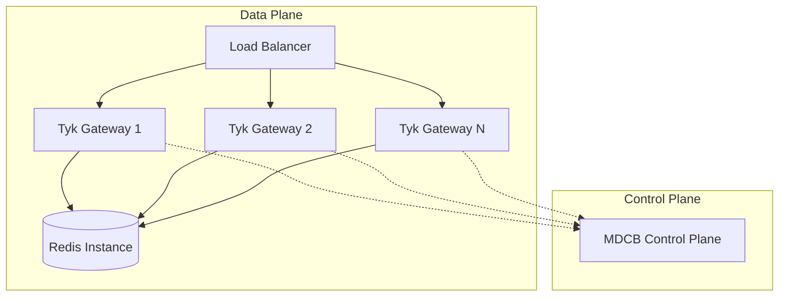
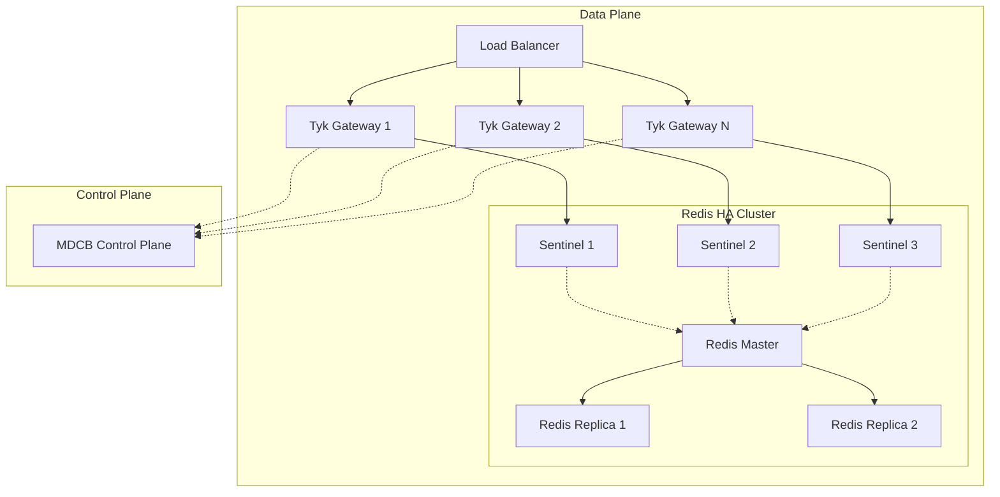
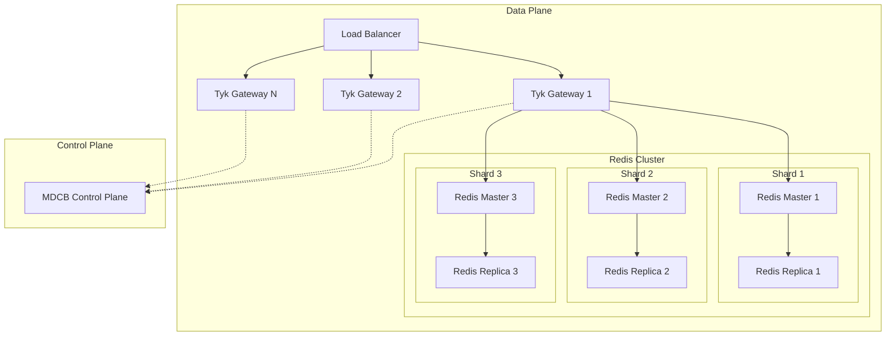
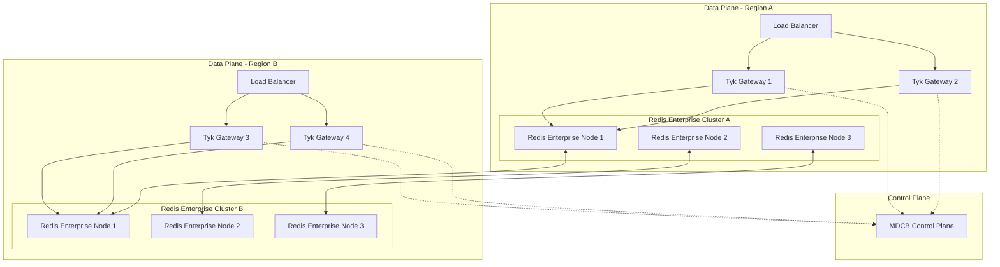

## Introduction

Redis is an essential prerequisite for the operation of Tyk products. It serves as the primary data store for various components across the Tyk Stack, handling critical functions such as key management, analytics storage, distributed rate limiting, and inter-node communication. Without Redis, Tyk components cannot function properly, making it a mandatory requirement for any Tyk deployment.

## Tyk Components Using Redis

| Component               | Redis Usage                                   |
|--------------------------|-----------------------------------------------|
| **Tyk Gateway**          | Session Management, Rate Limiting, Cache, Analytics, Cluster Synchronization |
| **Tyk Dashboard**        | Session Management, API Configuration, Developer Portal, Cluster Notifications |
| **Tyk Pump**             | Analytics Processing, Uptime Data            |
| **Tyk Identity Broker**  | Profile Storage, Token Caching               |
| **MDCB**                 | Configuration Synchronization, Analytics Aggregation |

## Supported Redis Versions

[Tyk components]() are regularly updated to maintain compatibility with current [Redis versions](https://redis.io/docs/latest/operate/rs/release-notes/). For specific Redis version compatibility information for each Tyk component:

Refer to the release notes of your specific Tyk component and version, which include documentation links and the compatibility matrix.

- **[Tyk Gateway]()**
- **[Tyk Dashboard]()**
- **[Tyk Pump]()**
- **[Tyk Identity Broker]()**
- **[MDCB]()**

## Redis Deployment Options

Tyk supports various Redis deployment configurations to meet different scalability and availability requirements:

This section provides architectural guidance for Redis deployment in Tyk [Data Plane]() environments within [Multi Data Center Bridge]() (MDCB) configurations.

In Tyk's MDCB architecture, the **Data Plane** consists of Tyk Gateway workers that serve API traffic and require Redis for session management, rate limiting, and caching. The Redis deployment strategy significantly impacts the overall system's availability, performance, and operational complexity.

<br>

> This section is written with the MDCB data plane in mind, but the same principles apply to standalone Tyk deployments.

### 1. Standalone Redis (Basic)

A single Redis instance provides the simplest deployment model suitable for development, testing, or low-criticality environments.



#### Characteristics

- **RTO**: 5-15 minutes (manual intervention required)
- **RPO**: 0-5 minutes (depending on persistence configuration)
- **Availability**: ~99.5%
- **Complexity**: Low
- **Cost**: Lowest

#### Configuration Recommendations

```yaml
# Redis Configuration

persistence: optional
backup-schedule: daily
monitoring: basic
```

#### Pros

- Simple to deploy and manage
- Minimal resource requirements
- No coordination overhead
- Suitable for containerized environments

#### Cons

- Single point of failure
- Manual recovery required
- Not suitable for production workloads
- Limited scalability

### 2. Redis Sentinel (High Availability)

Redis Sentinel provides automated failover capabilities with a master-replica setup, offering a good balance between availability and complexity.



#### Characteristics

- **RTO**: 30-60 seconds (automatic failover)
- **RPO**: <1 minute (asynchronous replication)
- **Availability**: ~99.9%
- **Complexity**: Medium
- **Cost**: Medium

#### Configuration Recommendations

```yaml
# Redis Master Configuration
persistence: enabled
replication: async
save: "900 1 300 10 60 10000"

# Sentinel Configuration
quorum: 2
down-after-milliseconds: 5000
failover-timeout: 10000
parallel-syncs: 1
```

#### Deployment Considerations

- Deploy 3 or 5 Sentinel instances (odd numbers recommended)
- Configure Tyk Gateways to connect through Sentinel
- Enable Redis persistence for data durability
- Monitor Sentinel logs for failover events

#### Pros

- Automatic failover
- High availability without sharding complexity
- Supports 16 logical databases
- Cost-effective for medium-scale deployments

#### Cons

- Still limited by single-threaded Redis performance
- Asynchronous replication can lead to data loss
- Requires careful network partition handling

To configure Tyk to work with Redis Sentinel, see the [Redis Sentinel configuration section]() below.

### 3. Redis Cluster (Horizontal Scaling)

Redis Cluster offers horizontal scaling capabilities through automatic sharding, making it suitable for high-throughput environments that require linear scalability.



#### Characteristics

- **RTO**: 10-30 seconds (automatic failover)
- **RPO**: <30 seconds (asynchronous replication)
- **Availability**: ~99.95%
- **Complexity**: High
- **Cost**: High

#### Configuration Recommendations

```yaml
# Redis Cluster Configuration
cluster-enabled: yes
cluster-config-file: nodes.conf
cluster-node-timeout: 5000
cluster-require-full-coverage: yes
cluster-migration-barrier: 1

# Minimum 6 nodes (3 masters + 3 replicas)
min-replicas-to-write: 1
```

#### Deployment Considerations

- Minimum six nodes (3 masters, three replicas) for production
- Only database 0 is available (no multiple logical databases)
- Multi-key operations require keys in the same hash slot
- Use hashtags for related keys:
    `{user:123}:session`, `{user:123}:profile`

#### Pros

- Linear horizontal scaling up to 1000 nodes
- Automatic sharding and rebalancing
- High throughput capabilities
- Automatic failover and recovery

#### Cons

- High operational complexity
- Limited multi-key operations
- No support for multiple databases
- Higher infrastructure costs
- Complex monitoring and troubleshooting

To configure Tyk to work with Redis Sentinel, see the [Redis Sentinel configuration section]() below.

### 4. Redis Enterprise (Mission-Critical)

Redis Enterprise provides enterprise-grade features including active-active replication, sub-millisecond latency, and 99.999% availability guarantees.



#### Characteristics

- **RTO**: <10 seconds (instant failover)
- **RPO**: <10 seconds (active-active replication)
- **Availability**: 99.999%+
- **Complexity**: Medium (managed service)
- **Cost**: Highest

#### Features

- Active-Active Geo-Distribution
- Automatic scaling and sharding
- Built-in monitoring and alerting
- Multi-model database support
- Enterprise security features

#### Pros

- Highest availability and performance
- Global distribution capabilities
- Comprehensive enterprise features
- Managed service reduces operational overhead
- Strong consistency options available

#### Cons

- Highest cost
- Vendor lock-in
- May be overkill for smaller deployments

### Decision Matrix

The following table summarizes the key characteristics of each Redis deployment option:

| Architecture      | RTO         | RPO        | Availability | Complexity | Use Case                     |
|-------------------|-------------|------------|--------------|------------|------------------------------|
| Single Redis      | 5–15 min    | 0–5 min    | 99.5%        | Low        | Development/Testing           |
| Redis with Sentinel | 30–60 sec | <1 min     | 99.9%        | Medium     | Production (Standard)         |
| Redis Cluster     | 10–30 sec   | <30 sec    | 99.95%       | High       | High-throughput Production    |
| Redis Enterprise  | <10 sec     | <10 sec    | 99.99%+      | Medium     | Mission-critical Enterprise   |

## Configure Redis with TLS

If you are using TLS for Redis connections, set `use_ssl` to `true` for Gateway and Pump, and `redis_use_ssl` to `true` for the dashboard.
Redis supports [SSL/TLS encryption](https://redis.io/topics/encryption) as of version 6, making it an optional feature that enhances the security of data in transit. Similarly, Amazon ElastiCache offers encryption in transit and at rest. To configure TLS or mTLS connections between an application and Redis, consider the following settings in Tyk's configuration files:

- `storage.use_ssl`: Set this to true to enable TLS encryption for the connection.

- `storage.ssl_insecure_skip_verify`: A flag that, when set to true, instructs the application not to verify the Redis server's TLS certificate. This is not recommended for production due to the risk of `man-in-the-middle` attacks.

From **Tyk 5.3**, additional options are available for more granular control:

- `storage.ca_file`: Path to the Certificate Authority (CA) file for verifying the Redis server's certificate.

- `storage.cert_file` and `storage.key_file`: Paths to your application's certificate and private key files, necessary for mTLS where both parties verify each other's identity.

- `storage.max_version` and `storage.min_version`: Define the acceptable range of TLS versions, enhancing security by restricting connections to secure TLS protocols (1.2 or 1.3).

**Setting up an Insecure TLS Connection**
- **Enable TLS**: By setting `"use_ssl": true`, you encrypt the connection.
- **Skip Certificate Verification**: Setting `"ssl_insecure_skip_verify": true` bypasses the server's certificate verification, suitable only for non-production environments.

**Setting up a Secure TLS Connection**
- Ensure `use_ssl` is set to `true`.
- Set `ssl_insecure_skip_verify` to `false` to enforce certificate verification against the CA specified in `ca_file`.
- Specify the path to the CA file in `ca_file` for server certificate verification.
- Adjust `min_version` and `max_version` to secure TLS versions, ideally 1.2 and 1.3.

**Setting up a Mutual TLS (mTLS) Connection**
- Follow the steps for a secure TLS connection.
- Provide paths for `cert_file` and `key_file` for your application's TLS certificate and private key, enabling the Redis server to verify your application's identity.

**Example Gateway Configuration**
```json
"storage": {
  "type": "redis",
  "addrs": [
    "server1:6379",
    "server2:6380",
    "server3:6381"
  ],
  "use_ssl": true,
  "ssl_insecure_skip_verify": false,
  "ca_file": "/path/to/ca.crt",
  "cert_file": "/path/to/client.crt",
  "key_file": "/path/to/client.key",
  "max_version": "1.3",
  "min_version": "1.2",
  "enable_cluster": true,
  "optimisation_max_idle": 2000,
  "optimisation_max_active": 4000
}
```

## Configure Redis Cluster

Our Gateway, Dashboard, and Pump all support integration with Redis Cluster. Redis Cluster allows data to be automatically sharded across multiple Redis Nodes. To set up Redis Cluster correctly, we recommend reading the [Redis Cluster Tutorial](https://redis.io/topics/cluster-tutorial). You must use the same settings across the Gateway, Dashboard, and Pump.


**Note**  

A Redis Cluster operates differently from a standard Redis setup, where one instance serves as the primary and others as replicas.


### Redis Cluster and Tyk Gateway 

To configure the Tyk Gateway to work with your Redis Cluster, set `enable_cluster` to `true` and list your servers under `addrs` in your `tyk.conf` file.


**Note**  

`addrs` is new in v2.9.3, and replaces `hosts`, which is now deprecated. 


If you are using TLS for Redis connections, set `use_ssl` to `true`.

```json
"storage": {
  "type": "redis",
  "enable_cluster": true,
  "addrs": [
    "server1:6379",
    "server2:6380",
    "server3:6381"
  ],
  "username": "",
  "password": "",
  "database": 0,
  "optimisation_max_idle": 2000,
  "optimisation_max_active": 4000,
  "use_ssl": false
},
```

### Redis Cluster and Tyk Dashboard


**Note**  

`redis_addrs` is new in v1.9.3 for the Dashboard, and replaces `hosts`, which is now deprecated. 



```json
"redis_addrs": [
    "server1:6379",
    "server2:6380",
    "server3:6381"
  ],
"redis_use_ssl": true,
"enable_cluster": true
```
To configure the Tyk Dashboard to work with your Redis Cluster, add the Redis address information to your `tyk_analytics.conf` file:


### Redis Cluster and Tyk Pump

To configure the Tyk Pump to work with your Redis Cluster, set `enable_cluster` to `true` and list your servers under `addrs` in your `pump.conf` file.


**Note**  

`addrs` is new in v2.9.3, and replaces `hosts`, which is now deprecated. 



```json
"analytics_storage_config": {
  "type": "redis",
  "enable_cluster": true,
  "addrs": [
    "server1:6379",
    "server2:6380",
    "server3:6381"
  ],
  "username": "",
  "password": "",
  "database": 0,
  "optimisation_max_idle": 100,
  "use_ssl": false
},
```

### Redis Cluster with Docker

For Redis clustered mode to work with Tyk using Docker and Amazon ElastiCache, follow these two steps:

1. **Make sure cluster mode is enabled**

Set the environment variable `TYK_GW_STORAGE_ENABLECLUSTER` to `true`.

2. **Add all cluster endpoints to the config**

Add all the Redis Cluster endpoints into Tyk, not just the primary. If Tyk can't see the whole cluster, then it will not work.

For ElastiCache Redis, you can bypass having to list all your nodes, and instead use the *configuration endpoint*,
This allows read and write operations, and the endpoint determines the correct node to target.

If this does not work, you can still list out the hosts using an environment variable. To do so, set the environment variable:

```{.copyWrapper}
TYK_GW_STORAGE_ADDRS="redis_primary1:port,redis_replica1:port,redis_primary2:port,redis_replica2:port,redis_primary3:port,redis_replica3:port"
```

It is essential that Tyk can connect to all primary and replica instances.

It is recommended to ensure that the connection pool is big enough. To do so, set the following environment variables:

```{.copyWrapper}
TYK_GW_STORAGE_MAXIDLE=6000
TYK_GW_STORAGE_MAXACTIVE=10000
```

**Note**  

These are suggested settings; please verify them by load testing.


## Configure Redis Sentinel

From v2.9.3, Redis Sentinel is supported.

Similar to Redis Cluster, our Gateway, Dashboard, and Pump all support integration with Redis Sentinel.

To configure Tyk to work with Redis Sentinel, list your servers under `addrs` and set the master name in your Gateway, Dashboard, Pump, and MDCB config. Unlike Redis Cluster, `enable_cluster` should **not** be set.  Indicative config snippets as follows:

### Redis Sentinel and Gateway

```json
"storage": {
  "type": "redis",
  "addrs": [
    "server1:26379",
    "server2:26379",
    "server3:26379"
  ],
  "master_name": "mymaster",
  "username": "",
  "password": "",
  "database": 0,
  "optimisation_max_idle": 2000,
  "optimisation_max_active": 4000,
  "use_ssl": false
},
```

### Redis Sentinel and Dashboard

```json
"redis_addrs": [
  "server1:26379",
  "server2:26379",
  "server3:26379"
],
"redis_master_name": "mymaster"
```

### Redis Sentinel and Pump

```json
"analytics_storage_config": {
  "type": "redis",
  "addrs": [
    "server1:26379",
    "server2:26379",
    "server3:26379"
  ],
  "master_name": "mymaster",
  "username": "",
  "password": "",
  "database": 0,
  "optimisation_max_idle": 100,
  "use_ssl": false
},
```


**Warning**

When using Bitnami charts to install Redis Sentinel in Kubernetes (k8s), a Redis service is exposed, which means that the standard Redis configuration is required instead of the above setup. In other words, a single server in `addrs` and `master_name` is not necessary.



### Support for Redis Sentinel AUTH

To support the use of Redis Sentinel AUTH (introduced in Redis 5.0.1), we have added the following global config settings in Tyk v3.0.2:

* In the Tyk Gateway config file - `sentinel_password`
* In the Tyk Dashboard config file - `redis_sentinel_password`
* In the Tyk Pump config file - `sentinel_password`
* In the Tyk Identity Broker config file - `SentinelPassword`
* In the Tyk Synk config file - `sentinel_password`

These settings allow you to support Sentinel password-only authentication in Redis version 5.0.1 and above.

See the Redis and Sentinel authentication section of the [Redis Sentinel docs](https://redis.io/topics/sentinel) for more details.

## FAQ

<details> <summary><b>What is Tyk Streams and what problem does it solve?</b></summary>

If you find that Tyk components fail to initialise when using Redis clustering, for example, the application does not start. The last log file entry shows a message such as `Using clustered mode`. Try setting the environment variable `REDIGOCLUSTER_SHARDCOUNT` to `128` on all hosts that connect to the Redis Cluster, i.e., Gateway, Dashboard, Pump, and MDCB. E.g.

`REDIGOCLUSTER_SHARDCOUNT=128`

If setting to `128` does not resolve the issue, try `256` instead.

</details> 

