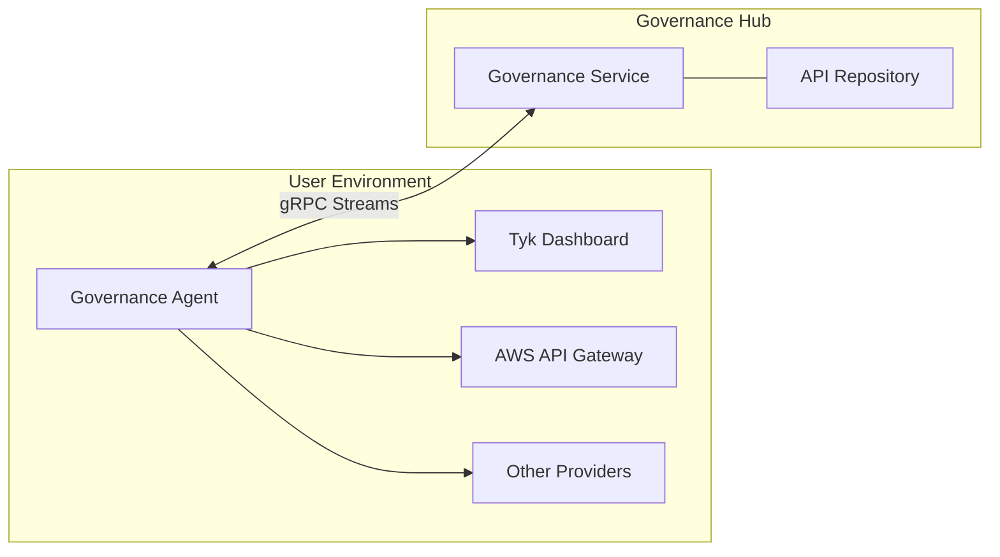

[Overview](#overview) | [Quick Start](#quick-start) | [How It Works](#how-it-works) | [Configuration Options](#configuration-options) | [Use Cases](#use-cases) | [Best Practices](#best-practices-and-recommendations) | [FAQs](#faqs)| [Troubleshooting](#troubleshooting)

### Availability

- Version: Available since v0.2
- Editions: All Tyk Governance editions

## Overview

Agent Management enables you to deploy, configure, and monitor the Tyk Governance agents that discover and synchronize APIs from various providers. These agents act as secure bridges between your API providers (Tyk Dashboard, AWS API Gateway, etc.) and the Tyk Governance Hub, ensuring your API inventory stays current and complete.


### Key Benefits

- **Centralized Agent Visibility**: Monitor all agents from a single dashboard
- **Scheduled Synchronization**: Configure automatic API discovery at regular intervals
- **High Availability Deployment**: Deploy multiple agent replicas with automatic leader election
- **Detailed Status Monitoring**: Track agent health, connection status, and synchronization history
- **Secure Communication**: All agent-to-hub communication is encrypted and authenticated

### Dependencies

- Requires Tyk Governance v0.2 or higher
- For Kubernetes-based high availability, requires Kubernetes cluster access

## Quick Start

In this tutorial, we'll set up a new agent, configure it to connect to an API provider, and monitor its status.

### Prerequisites

- Access to Tyk Governance Hub
- Access to an API provider (Tyk Dashboard or AWS API Gateway)
- A server or container environment to run the agent

### Step-by-Step

1. **Create a New Agent**

	 Use the API to create a new agent:

    ```sh
    # Replace with your actual Governance URL and API key
    GOVERNANCE_URL="https://your-governance-instance.tyk.io"
    API_KEY="your-access-key"
    AGENT_NAME="My API Provider Agent"

    # Create agent
    curl -s -X POST "${GOVERNANCE_URL}/api/agents/" \
        -H "X-API-Key: ${API_KEY}" \
        -H "Content-Type: application/json" \
        -d '{
            "name": "'"${AGENT_NAME}"'"
        }'
    ```

	 Note the agent ID returned in the response:

    ```json
    {"id":"a51d9bd0-bafe-4749-8285-e18641b151f2","name":"My API Provider Agent","last_heartbeat":"0001-01-01T00:00:00Z","status":"INACTIVE","providers":null}
    ```

2. **Generate an Agent Token**

	 Generate an authentication token for the agent:

    ```sh
    # Replace with the agent ID from the previous step
    AGENT_ID="a51d9bd0-bafe-4749-8285-e18641b151f2"

    # Generate token
    curl -X POST "${GOVERNANCE_URL}/api/auth/token/" \
        -H "X-API-Key: ${API_KEY}" \
        -H "Content-Type: application/json" \
        -d '{
            "agent_id": "'"${AGENT_ID}"'"
        }'
    ```

	 Save the token from the response:

    ```json
    {
        "token": "eyJhbGciOiJIUzI1NiIsInR5cCI6IkpXVCJ9..."
    }
    ```

3. **Create Agent Configuration File**

	 Create a file named `agent-config.yaml` with the following content:

    ```yaml
    # Tyk Governance Agent Configuration
    governanceDashboard:
        server:
            # The gRPC endpoint URL of the Tyk Governance service
            url: "your-governance-instance.tyk.io:50051"
        
        auth:
            # Authentication token for this agent
            token: "your-agent-token"

    # API Provider Configurations
    instances:
        # Example Tyk Provider Configuration
        - name: "tyk-provider"
            type: "tyk"
            config:
            host: "http://your-tyk-dashboard:3000"
            auth: "your-tyk-dashboard-api-key"
        
        # Example AWS API Gateway Configuration
        - name: "aws-provider"
            type: "aws"
            config:
            accessKeyId: "your-aws-access-key-id"
            accessKeySecret: "your-aws-access-key-secret"
            region: "us-east-1"

    # Sync schedule (added in v0.2)
    syncSchedule:
        # Enable scheduled synchronization
        enabled: true
        # Interval in minutes between syncs (minimum 5)
        intervalMinutes: 60

    # Agent Settings
    logLevel: info
    ```

4. **Deploy the Agent**

	 Run the agent using Docker:

    ```sh
    docker run -d --name tyk-governance-agent \
    -v $(pwd)/agent-config.yaml:/app/config.yaml \
    tykio/governance-agent:latest
    ```

	Or deploy to Kubernetes (for high availability):

    ```yaml
    apiVersion: apps/v1
    kind: Deployment
    metadata:
    name: governance-agent
    namespace: your-namespace
    spec:
    replicas: 2  # Multiple replicas for high availability
    selector:
        matchLabels:
        app: tyk-governance-agent
    template:
        metadata:
        labels:
            app: tyk-governance-agent
        spec:
        containers:
        - name: agent
            image: tykio/governance-agent:latest
            env:
            - name: TYK_AGENT_ENABLE_LEADER_ELECTION
            value: "true"
            volumeMounts:
            - mountPath: /app/config.yaml
            name: agent-config
            subPath: config.yaml
        volumes:
        - name: agent-config
            secret:
            secretName: agent-config
            items:
            - key: config.yaml
                path: config.yaml

    ```

5. **Monitor Agent Status**

	 Check the agent status in the Governance Hub:

    ```sh
    curl "${GOVERNANCE_URL}/api/agents/${AGENT_ID}" \
        -H "X-API-Key: ${API_KEY}"
    ```

	 A healthy agent will show:

    ```json
    {
        "id": "a51d9bd0-bafe-4749-8285-e18641b151f2",
        "name": "My API Provider Agent",
        "last_heartbeat": "2025-07-16T12:34:56Z",
        "status": "ACTIVE",
        "providers": [
            {
                "name": "tyk-provider",
                "type": "tyk"
            },
            {
                "name": "aws-provider",
                "type": "aws"
            }
        ]
    }
    ```

6. **Trigger Initial Synchronization**

	 Trigger a manual sync to verify the agent is working correctly:

    ```sh
    curl -X POST "${GOVERNANCE_URL}/api/sync" \
        -H "X-API-Key: ${API_KEY}" \
        -H "Content-Type: application/json" \
        -d '{}'
    ```

### Validation

- The agent should appear as "ACTIVE" in the agent list
- The agent's last heartbeat timestamp should be recent
- After synchronization, APIs from your providers should appear in the API Repository

## How It Works

Agent Management works through a distributed architecture where agents deployed in your environments connect to the central Governance Hub using secure gRPC streams.

### Agent Architecture



The agent establishes two persistent gRPC streams with the Governance Hub:

1. **Health Stream**: Sends regular heartbeats to indicate the agent is alive and functioning
2. **Sync Stream**: Used for API synchronization operations

When multiple agent replicas are deployed with leader election enabled, they use Kubernetes leader election to ensure only one instance actively performs synchronization, while others stand by as hot backups.

### Synchronization Process

Synchronization can be triggered in three ways:

1. **Manual Trigger**: Through the Governance Hub UI or API
2. **Scheduled Sync**: At regular intervals configured in the agent (new in v0.2)
3. **Initial Connection**: When an agent first connects to the Governance Hub

During synchronization:

1. The agent receives a sync request from the hub
2. The agent queries each configured API provider for APIs
3. The agent processes and normalizes the API definitions
4. The agent streams the API definitions to the hub
5. The hub processes and stores the API definitions
6. The hub reconciles the API inventory, marking missing APIs as deleted

### Deployment Scenarios

#### Multi-Provider API Discovery

Deploy agents to connect to different API providers across your organization, creating a comprehensive API inventory that spans platforms.

```yaml
# Agent configuration with multiple providers
instances:
  - name: "tyk-dashboard"
    type: "tyk"
    config:
      host: "http://tyk-dashboard:3000"
      auth: "your-tyk-api-key"
  
  - name: "aws-us-east"
    type: "aws"
    config:
      accessKeyId: "your-aws-access-key"
      accessKeySecret: "your-aws-secret-key"
      region: "us-east-1"
  
  - name: "aws-eu-west"
    type: "aws"
    config:
      accessKeyId: "your-aws-access-key"
      accessKeySecret: "your-aws-secret-key"
      region: "eu-west-1"
```

#### High Availability Agent Deployment

Deploy multiple agent replicas in Kubernetes to ensure continuous API discovery even if some instances fail.

```yaml
# Kubernetes deployment with leader election
apiVersion: apps/v1
kind: Deployment
metadata:
  name: governance-agent
spec:
  replicas: 3  # Multiple replicas for redundancy
  template:
    spec:
      containers:
      - name: agent
        env:
        - name: TYK_AGENT_ENABLE_LEADER_ELECTION
          value: "true"
```

#### Scheduled API Synchronization

Configure agents to automatically synchronize APIs at regular intervals to maintain an up-to-date inventory.

```yaml
# Agent configuration with scheduled sync
syncSchedule:
  enabled: true
  intervalMinutes: 120  # Sync every 2 hours
```

## Configuration Options

### Agent Configuration File

The agent is configured using a YAML configuration file with the following sections:

#### Core Configuration

```yaml
# Governance Dashboard Connection
governanceDashboard:
  server:
    url: "your-governance-instance.tyk.io:50051"
  auth:
    token: "your-agent-token"

# Log level (debug, info, warn, error)
logLevel: info

# Health probe configuration
healthProbe:
  server:
    port: 5959
```

#### API Provider Configuration

```yaml
# API Provider Configurations
instances:
  # Tyk Provider
  - name: "tyk-provider"
    type: "tyk"
    config:
      host: "http://dashboard:3000"
      auth: "your-tyk-api-key"
  
  # AWS API Gateway Provider
  - name: "aws-provider"
    type: "aws"
    config:
      accessKeyId: "your-aws-access-key-id"
      accessKeySecret: "your-aws-access-key-secret"
      region: "us-east-1"
      # Optional session token for temporary credentials
      sessionToken: "your-aws-session-token"
```

#### Scheduled Synchronization (New in v0.2)

```yaml
# Sync schedule configuration
syncSchedule:
  # Enable or disable scheduled synchronization
  enabled: true
  # Interval in minutes between syncs (minimum 5)
  intervalMinutes: 60
```

#### High Availability Configuration

```sh
# Leader election configuration (via environment variables)
# TYK_AGENT_ENABLE_LEADER_ELECTION=true
# TYK_AGENT_LEADER_ELECTION_NAMESPACE=your-namespace
# TYK_AGENT_LEADER_ELECTION_LOCK_NAME=governance-agent-lock
```

### Environment Variables

The agent supports configuration through environment variables:

|Variable|Description|Default|
|---|---|---|
|`TYK_AGENT_LICENSEKEY`|Your Tyk Governance license key|-|
|`TYK_AGENT_ENABLE_LEADER_ELECTION`|Enable Kubernetes leader election|`false`|
|`TYK_AGENT_LEADER_ELECTION_NAMESPACE`|Kubernetes namespace for leader election|Current namespace|
|`TYK_AGENT_LEADER_ELECTION_LOCK_NAME`|Name of the leader election lock|`governance-agent-lock`|
|`TYK_AGENT_RPC_KEEPALIVE_ENABLED`|Enable gRPC keepalive|`true`|
|`TYK_AGENT_RPC_KEEPALIVE_TIME`|Time between keepalive pings|`60s`|
|`TYK_AGENT_RPC_KEEPALIVE_TIMEOUT`|Timeout for keepalive pings|`20s`|

## Use Cases

### Multi-Region API Discovery

For organizations with APIs deployed across multiple geographic regions, deploy region-specific agents to efficiently discover and monitor APIs while respecting network boundaries.

**Implementation:**

1. Deploy agents in each region where APIs are hosted
2. Configure each agent with the appropriate regional API providers
3. Use descriptive names to identify regional agents
4. Monitor all agents from the central Governance Hub

**Benefits:**

- Reduced latency for API discovery operations
- Respect for network boundaries and security zones
- Improved reliability with region-specific agents
- Clear organization of APIs by region

### Secure Environment Bridging

For organizations with strict network segmentation, use agents to securely bridge between isolated environments without compromising security boundaries.

**Implementation:**

1. Deploy agents in each network segment
2. Configure outbound-only connections from agents to the Governance Hub
3. Use separate agents for production and non-production environments
4. Implement appropriate network security controls around agent traffic

**Benefits:**

- Maintain network isolation while enabling governance
- No inbound connections required to sensitive environments
- Granular control over which APIs are discovered
- Separation of concerns between environments

### Automated API Lifecycle Tracking

Use scheduled synchronization to automatically track the lifecycle of APIs, including when they're created, updated, or deleted from source providers.

**Implementation:**

1. Configure agents with scheduled synchronization
2. Set appropriate sync intervals based on change frequency
3. Use the API Repository to monitor API status
4. Create reports showing API lifecycle events

**Benefits:**

- Automatic detection of API changes
- Historical record of API lifecycle events
- Reduced manual tracking effort
- Improved visibility into API landscape evolution

## Best Practices and Recommendations

- **Use descriptive agent names** that indicate their purpose and scope
- **Deploy agents close to API providers** to minimize latency and network issues
- **Configure appropriate sync intervals** based on how frequently your APIs change
- **Use leader election for high availability** when deploying multiple agent replicas
- **Monitor agent health regularly** to ensure continuous API discovery
- **Rotate API provider credentials periodically** for better security
- **Use the principle of least privilege** when configuring API provider credentials
- **Start with manual syncs** before enabling scheduled synchronization
- **Implement network security controls** around agent traffic
- **Maintain agent versions** to ensure compatibility with the Governance Hub

## FAQs

<details> <summary><b>How many agents do I need?</b></summary>

The number of agents depends on your API landscape. Generally, you should consider deploying separate agents for:

- Different network segments or security zones
- Different geographic regions
- Different environments (production vs. non-production)
- Different API provider types with many APIs

A single agent can connect to multiple API providers of different types, so you don't necessarily need one agent per provider.

</details> <details> <summary><b>What happens if an agent goes offline?</b></summary>

If an agent goes offline, it will be marked as "INACTIVE" in the Governance Hub after missing several heartbeats. APIs discovered by that agent will remain in the repository but won't be updated until the agent reconnects or another agent is configured to discover the same APIs.

When using high availability with leader election, if the leader agent goes offline, another replica will automatically take over the leadership role and continue synchronization operations.

</details> <details> <summary><b>How secure is the agent-to-hub communication?</b></summary>

All communication between agents and the Governance Hub is secured using:

- TLS encryption for all traffic
- JWT token-based authentication
- Regular token validation
- Bidirectional stream validation

The agent only requires outbound connectivity to the Governance Hub, with no inbound connections required.

</details> <details> <summary><b>What permissions do agents need for API providers?</b></summary>

Agents require read-only access to API configurations:

- For Tyk Dashboard: An API key with read access to APIs and policies
- For AWS API Gateway: IAM credentials with permissions to list and get API Gateway resources
- For other providers: Similar read-only access to API configurations

The agent never requires write access to API providers.

</details>

## Troubleshooting

<details> <summary><b>Agent shows as "INACTIVE"</b></summary>

- Check if the agent process is running
- Verify network connectivity to the Governance Hub
- Ensure the agent token is valid and not expired
- Check agent logs for connection errors
- Verify the Governance Hub URL is correct
- Ensure the agent has outbound access to the hub's gRPC port. It is usually 50051 for self-managed instances. For Tyk Cloud managed instance, it is proxied through port 443.

</details> <details> <summary><b>Agent connects but no APIs are discovered</b></summary>

- Verify API provider credentials are correct
- Check agent logs for provider connection errors
- Ensure the provider has APIs configured
- Try triggering a manual sync operation
- Check agent configuration for correct provider URLs
- Verify the agent has network access to the API providers

</details> <details> <summary><b>Multiple agents running when using leader election</b></summary>

- Verify leader election is properly configured
- Check if agents are in the same Kubernetes namespace
- Ensure agents are using the same lock name
- Check Kubernetes permissions for leader election
- Verify Kubernetes API access from agent pods
- Check agent logs for leader election messages

</details> <details> <summary><b>Scheduled sync not working</b></summary>

- Verify `syncSchedule.enabled` is set to `true`
- Check that `intervalMinutes` is set to at least 5
- Ensure the agent has been running long enough for a scheduled sync
- Check agent logs for scheduled sync messages
- Try restarting the agent to reset the schedule
- Verify the agent is the leader if using leader election

</details>
