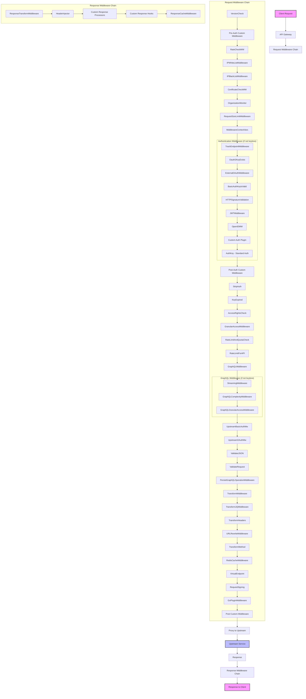

---
date: 2024-01-01T00:00:00Z
title: Tyk Middleware Chain
tags: ["Tyk Gateway", "Middleware", "Architecture", "Request Flow"]
description: "Visual diagram showing the complete Tyk middleware chain flow for request and response processing"
weight: 10
---

Tyk middleware flow diagram:

