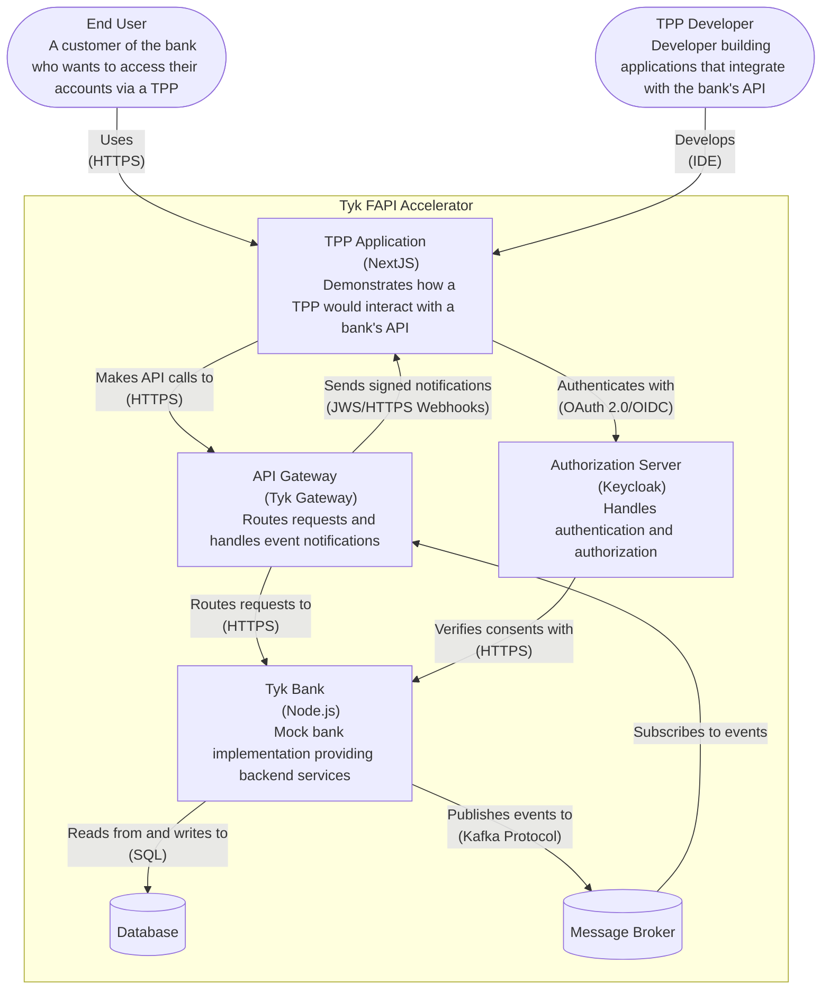
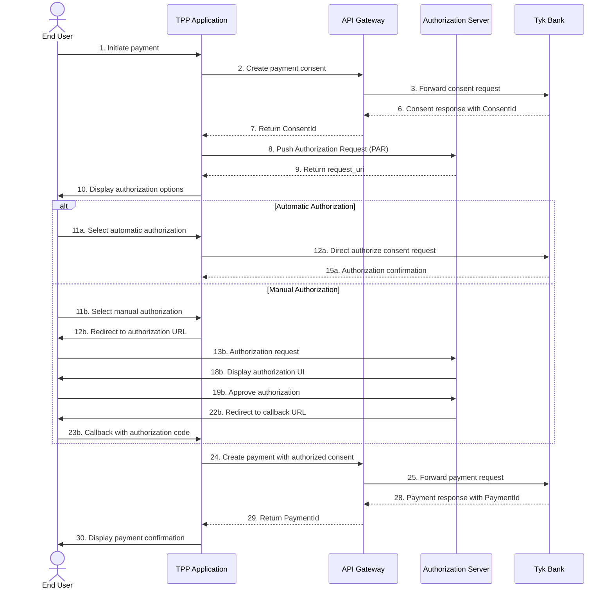
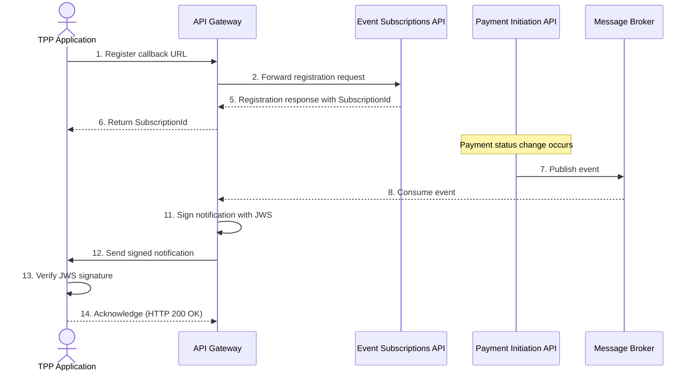

## Introduction

Financial institutions are embracing Open Banking initiatives to foster innovation, enhance customer experiences, and comply with regulatory requirements. These initiatives require secure, reliable, and standards-compliant APIs that can safely expose sensitive financial data to third-party providers (TPPs). This document explores how Tyk API Gateway, through its FAPI Accelerator, enables financial institutions to implement robust Open Banking solutions.

## Challenges in Financial Services API Implementation

Financial institutions face several challenges when implementing Open Banking APIs:

1. **Security and Compliance**: Meeting stringent security requirements of Financial-grade API (FAPI) specifications and regulatory standards like PSD2, UK Open Banking, and Consumer Data Right (CDR).

2. **Authentication Complexity**: Implementing advanced authentication mechanisms like OAuth 2.0 with Pushed Authorization Requests (PAR) and Demonstrating Proof of Possession (DPoP).

3. **Event Notifications**: Securely delivering real-time notifications about account and payment events to third parties.

4. **Idempotency**: Ensuring that duplicate requests (especially for payments) don't result in duplicate transactions.

5. **Developer Experience**: Providing a seamless experience for TPP developers while maintaining security.

## Tyk FAPI Accelerator Solution

The Tyk FAPI Accelerator is a comprehensive solution that addresses these challenges through a modular, standards-compliant architecture:

### Architecture Overview

### Key Components

1. **API Gateway (Tyk Gateway)**:
   - Routes API requests to appropriate backend services
   - Implements DPoP authentication via gRPC plugin
   - Handles idempotency for payment requests
   - Signs and delivers event notifications to TPPs

2. **Authorization Server (Keycloak)**:
   - Provides FAPI 2.0 compliant OAuth 2.0 and OpenID Connect
   - Supports Pushed Authorization Requests (PAR)
   - Manages user authentication and consent

3. **Mock Bank Implementation**:
   - Implements UK Open Banking Account Information API
   - Implements UK Open Banking Payment Initiation API
   - Implements UK Open Banking Event Subscriptions API
   - Provides realistic testing environment

4. **TPP Application**:
   - Demonstrates how third parties integrate with the bank's APIs
   - Implements FAPI 2.0 security profile
   - Shows account information retrieval and payment initiation flows

### Security Features

The Tyk FAPI Accelerator implements several security features required for financial-grade APIs:

1. **DPoP (Demonstrating Proof of Possession)**:
   - Ensures the client possesses the private key corresponding to the public key in the token
   - Prevents token theft and replay attacks
   - Implemented as a gRPC plugin for Tyk Gateway

2. **JWS Signing for Event Notifications**:
   - Signs webhook notifications with JSON Web Signatures (JWS)
   - Ensures authenticity and integrity of notifications
   - Allows TPPs to verify the source of notifications

3. **Idempotency Support**:
   - Prevents duplicate transactions from repeated API calls
   - Caches responses for idempotent requests
   - Includes automatic garbage collection of expired entries

4. **OAuth 2.0 with PAR**:
   - Implements Pushed Authorization Requests for enhanced security
   - Supports both automatic and manual authorization flows
   - Complies with FAPI 2.0 security profile

## Implementation Examples

### Payment Flow Example

The following sequence diagram illustrates a typical payment flow in the Tyk FAPI Accelerator:

### Event Notification Example

The event notification system allows TPPs to receive updates about payment status changes:

## Benefits for Financial Institutions

Implementing Open Banking with Tyk FAPI Accelerator provides several benefits:

1. **Faster Time to Market**: Pre-built components and configurations reduce development time.

2. **Regulatory Compliance**: Built-in support for FAPI, OAuth 2.0, and other standards ensures compliance with regulatory requirements.

3. **Enhanced Security**: Advanced security features like DPoP, JWS signing, and idempotency protect sensitive financial data.

4. **Scalability**: Tyk's architecture allows for horizontal scaling to handle increasing API traffic.

5. **Developer-Friendly**: Comprehensive documentation and example applications make it easier for TPP developers to integrate.

## Getting Started

To get started with the Tyk FAPI Accelerator:

1. **Prerequisites**:
   - Tyk API Gateway
   - Docker and Docker Compose
   - Go 1.24 or higher (for plugin development)

2. **Setup Steps**:
   - Clone the Tyk FAPI Accelerator repository
   - Set up the Authorization Server (Keycloak)
   - Configure and run the gRPC plugin
   - Start the mock bank implementation
   - Run the TPP application for testing

3. **Testing**:
   - Use the TPP application to test account information retrieval
   - Test payment initiation flows
   - Verify event notification delivery

## Conclusion

The Tyk FAPI Accelerator provides a comprehensive solution for financial institutions implementing Open Banking APIs. By addressing the key challenges of security, authentication, event notifications, and developer experience, it enables banks to quickly deploy standards-compliant APIs that meet regulatory requirements while providing a seamless experience for TPP developers and end users.

With its modular architecture and extensive documentation, the Tyk FAPI Accelerator serves as both a reference implementation and a starting point for production deployments, helping financial institutions navigate the complex landscape of Open Banking with confidence.